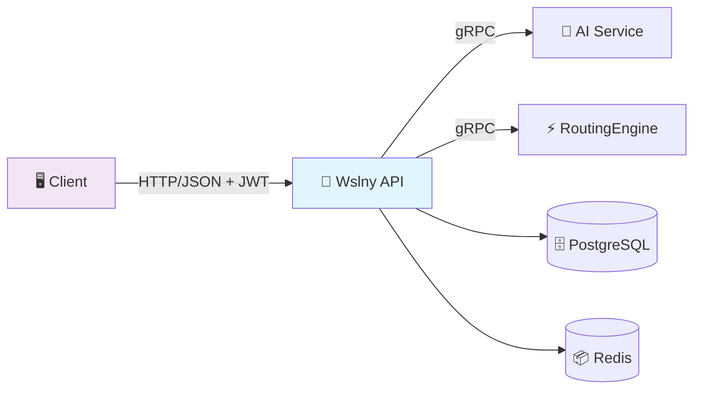
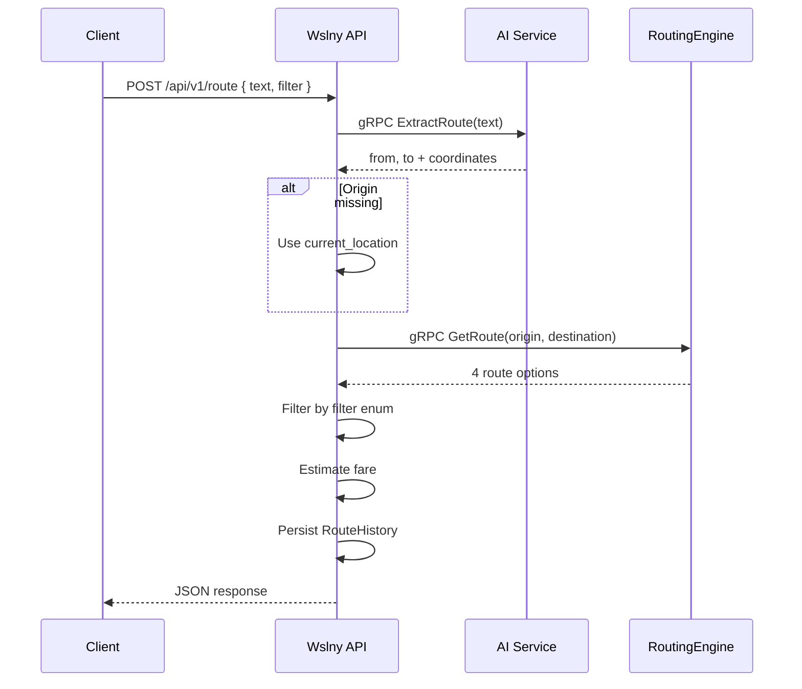
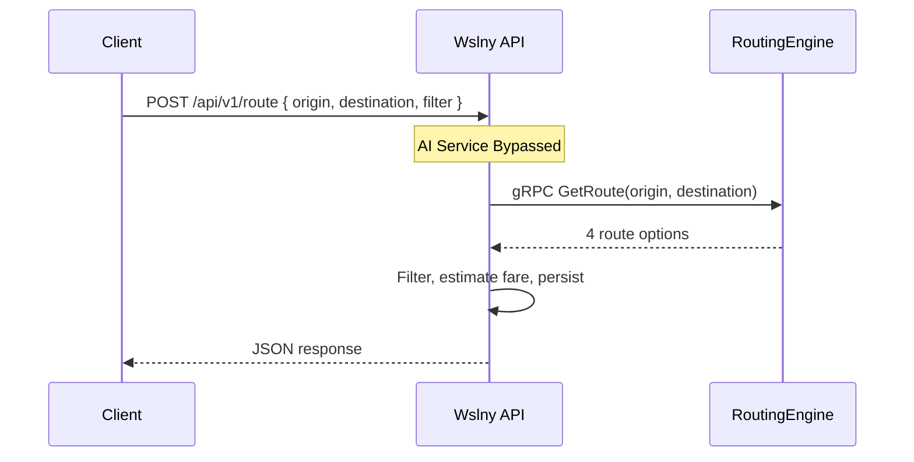
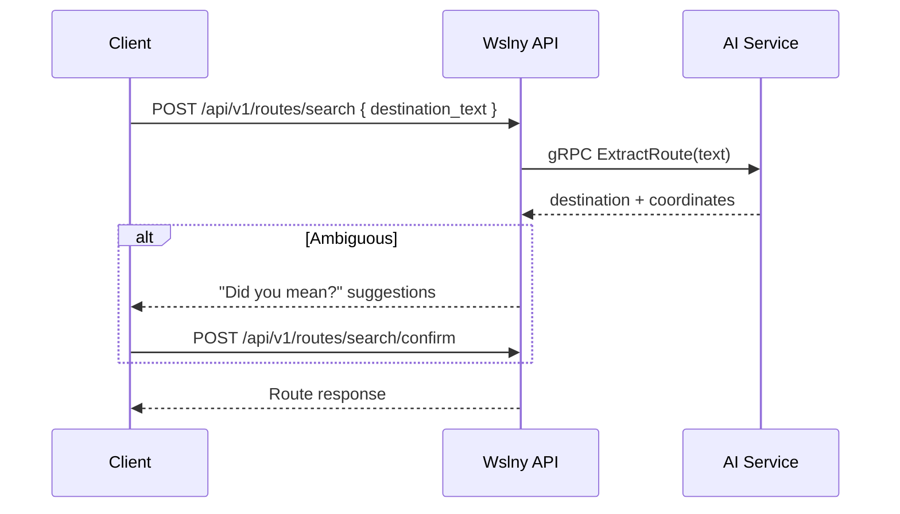

# Wslny API — Gateway & Orchestrator

<!-- Badges -->


The Wslny API is the **public backend gateway** for the platform. It handles authentication, request validation, service orchestration, persistence, admin analytics, and serves transit data to clients.

> **Important**: Frontends must call this service only — never the AI or routing services directly.

---

## 🎯 Role In The System



| Responsibility | Description |
|----------------|-------------|
| **HTTP Gateway** | Exposes HTTP/JSON endpoints to web/mobile clients |
| **Auth & Security** | Enforces JWT security and role-based access control (User / Admin) |
| **Orchestration** | Coordinates internal gRPC calls to AI Service and Routing Engine |
| **Persistence** | Persists route history, feedback, and serves admin statistics |
| **Transit Data** | Provides cached GTFS transit data (stops, lines, polylines) |
| **User Features** | Manages saved locations, favorites, preferences |

---

## 🔄 Flow Logic

### Text Input (Natural Language)



### Map-Pin Input (Coordinates Only)



### Search Flow (Destination Suggestions)



---

## 📡 API Endpoint Summary

All endpoints are versioned under `/api/v1/`.

### Authentication

| Method | Endpoint | Auth | Description |
|--------|----------|------|-------------|
| POST | `/api/v1/auth/register` | Public | Register new user |
| POST | `/api/v1/auth/login` | Public | Email/password login |
| POST | `/api/v1/auth/google-login` | Public | Google OAuth login |
| GET | `/api/v1/auth/profile` | JWT | Get user profile |
| PUT | `/api/v1/auth/profile` | JWT | Update user profile |
| POST | `/api/v1/auth/change-password` | JWT | Change password |
| POST | `/api/v1/auth/refresh` | Refresh Token | Refresh access token |

### Routing

| Method | Endpoint | Auth | Description |
|--------|----------|------|-------------|
| POST | `/api/v1/route` | JWT | Get route by text or coordinates |
| GET | `/api/v1/route/history` | JWT | User's route history |
| POST | `/api/v1/routes/search` | JWT | Search destination with suggestions |
| POST | `/api/v1/routes/search/confirm` | JWT | Confirm destination and get route |
| GET | `/api/v1/routes/metadata` | JWT | Filter options and transport methods |
| POST | `/api/v1/routes/alternatives` | JWT | All viable route alternatives |
| POST | `/api/v1/routes/feedback` | JWT | Submit route rating (1-5) |

### Transit Data

| Method | Endpoint | Auth | Description |
|--------|----------|------|-------------|
| GET | `/api/v1/stops/nearby` | JWT | Nearby stops with lines |
| GET | `/api/v1/stops/<id>` | JWT | Stop detail with passing lines |
| GET | `/api/v1/lines` | JWT | All transit lines |
| GET | `/api/v1/lines/<id>` | JWT | Line detail with stops + polyline |

### User Features

| Method | Endpoint | Auth | Description |
|--------|----------|------|-------------|
| GET/POST | `/api/v1/user/saved-locations` | JWT | List / create saved locations |
| GET/PUT/DELETE | `/api/v1/user/saved-locations/<id>` | JWT | Retrieve / update / delete |
| GET/POST | `/api/v1/user/favorites` | JWT | List / create favorite routes |
| GET/DELETE | `/api/v1/user/favorites/<id>` | JWT | Retrieve / delete |
| GET/PUT | `/api/v1/user/preferences` | JWT | Get / update preferences |

### Admin

| Method | Endpoint | Auth | Description |
|--------|----------|------|-------------|
| POST | `/api/v1/admin/change-role` | Admin | Change user role |
| GET | `/api/v1/admin/users` | Admin | List all users |
| GET/PUT/DELETE | `/api/v1/admin/users/<id>` | Admin | User detail + stats / update / deactivate |
| GET | `/api/v1/admin/analytics/routes/overview` | Admin | Route analytics summary |
| GET | `/api/v1/admin/analytics/routes/top-routes` | Admin | Most requested O→D pairs |
| GET | `/api/v1/admin/analytics/routes/filters` | Admin | Filter usage statistics |
| GET | `/api/v1/admin/analytics/routes/unresolved` | Admin | Failed queries analysis |
| GET | `/api/v1/admin/analytics/routes/query` | Admin | Generic composable analytics |
| GET | `/api/v1/admin/analytics/users/overview` | Admin | User growth + activity |
| GET | `/api/v1/admin/analytics/feedback` | Admin | Feedback list with filters |
| GET | `/api/v1/admin/analytics/feedback/summary` | Admin | Rating distribution + averages |

### System

| Method | Endpoint | Auth | Description |
|--------|----------|------|-------------|
| GET | `/api/health` | Public | Health check (DB + gRPC deps) |
| GET | `/api/schema/` | Public | OpenAPI 3 schema |
| GET | `/api/docs/` | Public | Swagger UI |

---

## 🏗️ Architecture

The Django API follows Clean Architecture / DDD-lite principles:

```text
src/
├── Core/                    # Domain + Application (business logic)
│   ├── Application/         # Use cases (CQRS pattern)
│   │   ├── Admin/          # Analytics commands & queries
│   │   ├── Authentication/ # Register, login, OAuth handlers
│   │   ├── Transit/        # GTFS data service (cached CSV)
│   │   └── Common/         # CQRS interfaces (ICommand, IQuery), Result type
│   └── Domain/             # Constants (Roles), Domain errors
├── Infrastructure/         # External concerns
│   ├── GrpcClients/        # Thread-safe gRPC client singletons
│   ├── History/            # RouteHistory, RouteFeedback models
│   └── Identity/           # User, SavedLocation, FavoriteRoute, UserPreferences
└── Presentation/           # API layer
    ├── settings.py         # All configuration (env-driven)
    ├── root_urls.py        # Single ROOT_URLCONF for all endpoints
    ├── schemas.py          # Shared serializers + filter enum
    ├── permissions.py      # IsAdminUser permission class
    ├── logging_formatter.py # JSON structured logging
    └── views/              # API view classes
```

---

## 🔧 Why This Design

| Benefit | Explanation |
|---------|-------------|
| **Single auth boundary** | Frontend only needs to manage one authentication domain |
| **Bypass path for map-pin** | Map-pin requests skip AI service entirely for lower latency |
| **Observability** | All requests logged with latency metrics for analytics |
| **Transit data independence** | Clients can browse stops/lines without calling routing |
| **Scalability** | Stateless API can scale horizontally behind a load balancer |

---

## 🚀 Running

**Recommended via root compose:**

```bash
docker compose up --build
```

The runnable Django project is in `API/Wslny/`. See [`API/Wslny/README.md`](Wslny/README.md) for startup details and environment variables.