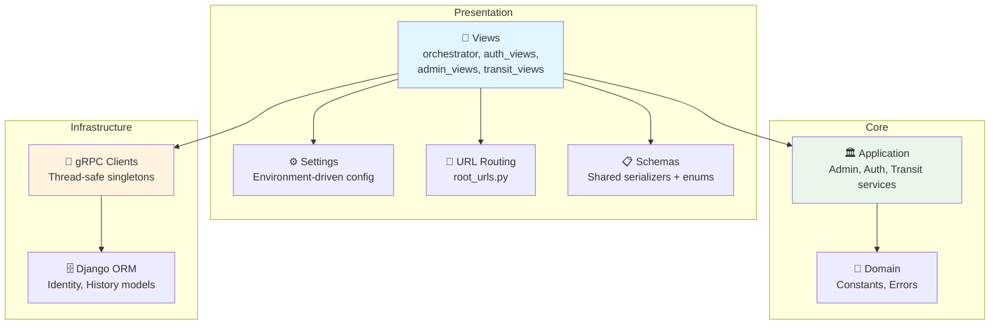

# Wslny Runtime Service

<!-- Badges -->


This folder contains the **runnable Django service** for the Wslny API.

---

## 🎯 Responsibilities

- HTTP API for authentication, routing, transit data, user features, and admin analytics
- gRPC clients for `Ai-Service` and `RoutingEngine` (thread-safe singletons)
- Route orchestration for text and map modes
- Route history and feedback persistence
- Fare estimation (metro tiered, bus/microbus per-ride)
- GTFS transit data service (cached CSV reader)
- OpenAPI/Swagger documentation via drf-spectacular

---

## 🏗️ Architecture Within This Service



### Directory Structure

```
src/
├── Core/                          # Business logic (no framework dependencies)
│   ├── Application/               # Use cases (CQRS pattern)
│   │   ├── Admin/                 # Analytics commands & queries
│   │   ├── Authentication/        # Register, login, OAuth handlers
│   │   ├── Transit/               # GTFS data service (cached CSV reader)
│   │   └── Common/                # CQRS interfaces (ICommand, IQuery), Result type
│   └── Domain/                    # Domain models, constants, errors
│       ├── Constants/             # Roles enum (Admin, User)
│       └── Errors/                # Typed domain errors
├── Infrastructure/                # External concerns
│   ├── GrpcClients/               # Thread-safe gRPC client singletons
│   │   ├── __init__.py            # Lazy initialization with error capture
│   │   ├── ai_client.py           # AI service adapter
│   │   ├── routing_client.py      # Routing engine adapter + polyline parsing
│   │   └── stubs/                 # Auto-generated protobuf stubs
│   ├── History/                   # RouteHistory, RouteFeedback models
│   └── Identity/                  # User, SavedLocation, FavoriteRoute, UserPreferences
└── Presentation/                  # API layer
    ├── settings.py               # All config driven by environment variables
    ├── root_urls.py              # Single ROOT_URLCONF for all endpoints
    ├── schemas.py                # Shared serializers + filter enum constants
    ├── permissions.py            # IsAdminUser permission class
    ├── logging_formatter.py     # JSON structured logging formatter
    └── views/                    # API view classes
```

---

## 🔧 Environment Variables

### Database

| Variable | Default | Description |
|----------|---------|-------------|
| `DB_NAME` | `wslny` | PostgreSQL database name |
| `DB_USER` | `postgres` | Database user |
| `DB_PASSWORD` | `postgres` | Database password |
| `DB_HOST` | `db` | Database host |
| `DB_PORT` | `5432` | Database port |
| `DB_CONN_MAX_AGE` | `60` | Persistent connection lifetime (seconds) |

### gRPC Services

| Variable | Default | Description |
|----------|---------|-------------|
| `AI_GRPC_HOST` | `ai-service` | AI service gRPC host |
| `AI_GRPC_PORT` | `50052` | AI service gRPC port |
| `AI_GRPC_TIMEOUT_SECONDS` | `120.0` | AI service timeout |
| `ROUTING_GRPC_HOST` | `routing-engine` | Routing engine gRPC host |
| `ROUTING_GRPC_PORT` | `50051` | Routing engine gRPC port |
| `ROUTING_GRPC_TIMEOUT_SECONDS` | `120.0` | Routing engine timeout |

### Cache

| Variable | Default | Description |
|----------|---------|-------------|
| `REDIS_URL` | `redis://redis:6379/0` | Redis connection URL |
| `GTFS_CACHE_TIMEOUT` | `86400` | GTFS cache TTL (seconds) |
| `ROUTE_CACHE_TIMEOUT` | `300` | Route result cache TTL (seconds) |

### Fare Configuration

| Variable | Default | Description |
|----------|---------|-------------|
| `FARE_BUS_PER_RIDE` | `20` | Bus fare per ride (EGP) |
| `FARE_MICROBUS_PER_RIDE` | `10` | Microbus fare per ride (EGP) |
| `FARE_METRO_UP_TO_9` | `8` | Metro fare for ≤9 stops |
| `FARE_METRO_UP_TO_16` | `10` | Metro fare for 10-16 stops |
| `FARE_METRO_UP_TO_23` | `15` | Metro fare for 17-23 stops |
| `FARE_METRO_ABOVE_39` | `20` | Metro fare for 40+ stops |

### Security

| Variable | Default | Description |
|----------|---------|-------------|
| `DJANGO_SECRET_KEY` | — | Django secret key (REQUIRED in production) |
| `DEBUG` | `True` | Debug mode |
| `ALLOWED_HOSTS` | `*` | Comma-separated allowed hosts |
| `CORS_ALLOWED_ORIGINS` | `""` | Comma-separated allowed origins (empty = allow all) |
| `ADMIN_PASSWORD` | — | Initial admin password (seeded on startup) |

### Server

| Variable | Default | Description |
|----------|---------|-------------|
| `GUNICORN_WORKERS` | `4` | Number of Gunicorn workers |
| `GUNICORN_THREADS` | `2` | Threads per worker |
| `GUNICORN_TIMEOUT` | `120` | Worker timeout (seconds) |
| `LOG_LEVEL` | `INFO` | Root log level |
| `APP_LOG_LEVEL` | `INFO` | Application log level |

---

## 🚀 Startup

**From repository root (recommended):**

```bash
docker compose up --build
```

The `entrypoint.sh` script:
1. Generates gRPC Python stubs from proto files
2. Runs database migrations
3. Seeds admin user (email: `admin@wslny.com`, password from `ADMIN_PASSWORD` env var)
4. Starts Gunicorn

### API Docs

| Resource | URL |
|----------|-----|
| Schema | `http://localhost:8000/api/schema/` |
| Swagger UI | `http://localhost:8000/api/docs/` |

Use `Bearer <jwt_token>` in Swagger "Authorize" to test protected endpoints.

---

## 🚦 Route Filter Enum

| Value | Name | Description |
|-------|------|-------------|
| 1 | `optimal` | Best overall route across all transport modes |
| 2 | `fastest` | Shortest total duration |
| 3 | `cheapest` | Lowest estimated fare |
| 4 | `bus_only` | Uses only bus + walking |
| 5 | `microbus_only` | Uses only microbus + walking |
| 6 | `metro_only` | Uses only metro + walking |

---

## 💰 Fare Calculation

| Transport | Method | Cost |
|-----------|--------|------|
| **Metro** | Tiered by total metro stops | ≤9 stops: 8 EGP, ≤16: 10 EGP, ≤23: 15 EGP, ≤39: 20 EGP, 40+: 20 EGP |
| **Bus** | Per ride segment | 20 EGP |
| **Microbus** | Per ride segment | 10 EGP |

---

## ⚡ Rate Limiting

| User Type | Limit |
|-----------|-------|
| Anonymous | 30 requests/minute |
| Authenticated | 60 requests/minute |
| Health endpoint | **Exempt** |

---

## 🧪 Client Integration Examples

```bash
# Health check
curl http://localhost:8000/api/health

# Register
curl -X POST http://localhost:8000/api/v1/auth/register \
  -H "Content-Type: application/json" \
  -d '{"email":"user@example.com","password":"pass123","first_name":"Test","last_name":"User","mobile_number":"+201234567890"}'

# Login
curl -X POST http://localhost:8000/api/v1/auth/login \
  -H "Content-Type: application/json" \
  -d '{"email":"user@example.com","password":"pass123"}'

# Route by text
curl -X POST http://localhost:8000/api/v1/route \
  -H "Authorization: Bearer <token>" \
  -H "Content-Type: application/json" \
  -d '{"text": "عايز اروح العباسيه من مسكن", "filter": 1}'

# Route by coordinates
curl -X POST http://localhost:8000/api/v1/route \
  -H "Authorization: Bearer <token>" \
  -H "Content-Type: application/json" \
  -d '{"origin":{"lat":30.05,"lon":31.24},"destination":{"lat":30.07,"lon":31.28},"filter":3}'

# Search destination
curl -X POST http://localhost:8000/api/v1/routes/search \
  -H "Authorization: Bearer <token>" \
  -H "Content-Type: application/json" \
  -d '{"destination_text":"العباسية","current_location":{"lat":30.12,"lon":31.34},"filter":1}'

# Nearby stops
curl -G "http://localhost:8000/api/v1/stops/nearby?lat=30.05&lon=31.24&radius=500" \
  -H "Authorization: Bearer <token>"

# Route alternatives
curl -X POST http://localhost:8000/api/v1/routes/alternatives \
  -H "Authorization: Bearer <token>" \
  -H "Content-Type: application/json" \
  -d '{"origin_lat":30.05,"origin_lon":31.24,"destination_lat":30.07,"destination_lon":31.28}'
```