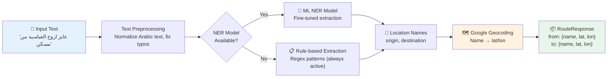

# Ai-Service — NLP Location Extraction + Geocoding

<!-- Badges -->


**Ai-Service** is a Python gRPC microservice that converts natural language trip requests (Arabic/English) into structured locations and coordinates.

> **Note**: Ai-Service does **not** calculate routes. Pathfinding is handled by `RoutingEngine`.

---

## 🎯 Responsibilities

- Parse free-form text (Arabic/English) to detect origin and destination
- Handle conversational Arabic patterns and common typo aliases for Cairo locations
- Geocode extracted places to latitude/longitude using Google Maps
- Return interpretation result to Wslny API over gRPC

---

## 🔄 How It Works



---

## 🧠 Two-Stage Extraction

### Stage 1: Named Entity Recognition

| Layer | Strategy | When Used |
|-------|----------|-----------|
| **ML NER** | Fine-tuned model in `TransitModel/` | Primary when weights exist |
| **Rule-based** | Regex patterns for Arabic/English phrases | Always active (fallback) |
| **Alias normalization** | Maps typos/colloquial names to canonical forms | In rule-based pipeline |

**Common Arabic patterns:**
- `عايز اروح [DEST] من [ORIGIN]`
- `محتاج اوصل [DEST]`
- `[DEST]` (destination only)

### Stage 2: Geocoding

- Extracted location names → Google Maps Geocoding API
- Results **cached in-memory** to reduce API calls
- Returns coordinates + resolved name

---

## 📡 gRPC Contract

**Service**: `TransitInterpreter`
**RPC**: `ExtractRoute(RouteRequest) -> RouteResponse`
**Proto source**: `shared/protos/interpreter.proto`

```protobuf
service TransitInterpreter {
  rpc ExtractRoute (RouteRequest) returns (RouteResponse) {}
}

message RouteRequest {
  string text = 1;
}

message RouteResponse {
  string from_location = 1;
  string to_location = 2;
  Location from_coordinates = 6;
  Location to_coordinates = 7;
  string intent = 8;
}
```

---

## 📊 Destination-Only Requests

The service can return a valid result with only a destination:

```json
{
  "from_location": "",
  "from_coordinates": null,
  "to_location": "شيراتون",
  "to_coordinates": { "latitude": 30.10, "longitude": 31.37 },
  "intent": "standard"
}
```

In this case, the Wslny API uses the client's `current_location` as the origin.

---

## 📁 Project Structure

```
Ai-Service/
├── Server.py              # gRPC server entrypoint (port 50052)
├── geocoder.py            # Google Maps geocoding + in-memory cache
├── TransitModel/          # NER model weights (gitignored)
│   ├── tokenizer.json
│   └── tokenizer_config.json
├── protos/                # Local proto copy for Docker build
├── tests/
│   └── test_flow.py       # Regression tests for Arabic phrases
├── Dockerfile
└── Requirements.txt
```

---

## 🔧 Environment

| Variable | Required | Description |
|----------|----------|-------------|
| `GOOGLE_MAPS_API_KEY` | **Yes** | Google Maps Geocoding API key |

---

## 💾 Caching Strategy

| Cache | Type | What | Lifetime |
|-------|------|------|----------|
| **Geocoding** | In-memory dict | Place name → coordinates | Process lifetime |
| **Model** | File-based | NER tokenizer weights | Loaded at startup |

---

## 🚀 Running

**Recommended via root compose:**

```bash
docker compose up --build
```

**Standalone:**

```bash
docker build -f Ai-Service/Dockerfile -t ai-service .
docker run -p 50052:50052 -e GOOGLE_MAPS_API_KEY=your_key ai-service
```

---

## 🧪 Testing

```bash
# Run tests inside Docker
docker compose exec ai-service python -m pytest tests/

# Test a real request
docker compose exec ai-service python test_real_request.py
```

---

## ✅ Accuracy Strategy

| Layer | Strategy |
|-------|----------|
| ML NER | Fine-tuned model in `TransitModel/` — used when weights available |
| Rule-based | Regex patterns for common Arabic/English location expressions — always active |
| Alias normalization | Maps frequent typos and colloquial names to canonical forms |
| Geocoding cache | Reduces API calls for repeated place names |
| Regression tests | `tests/test_flow.py` covers critical Arabic phrases |

---

## 🎯 Why This Separation Matters

| Benefit | Explanation |
|---------|-------------|
| **Isolation** | NLP complexity doesn't affect pathfinding stability |
| **Low latency** | Map-pin requests skip AI entirely for faster responses |
| **Independent scaling** | Text vs. map traffic can be managed separately |
| **Cost control** | Geocoding cache reduces Google Maps API costs |