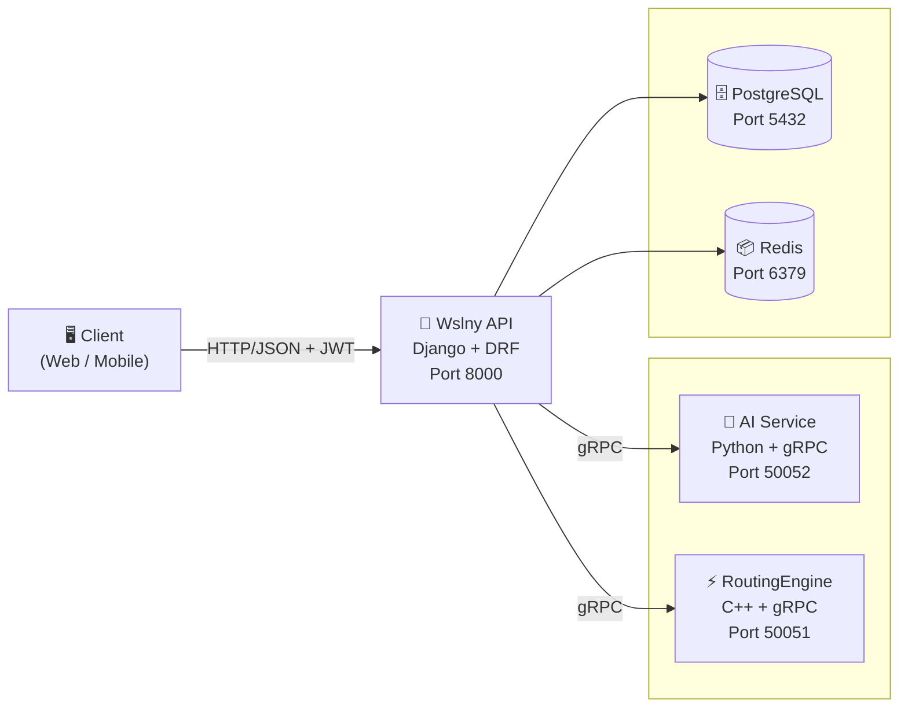
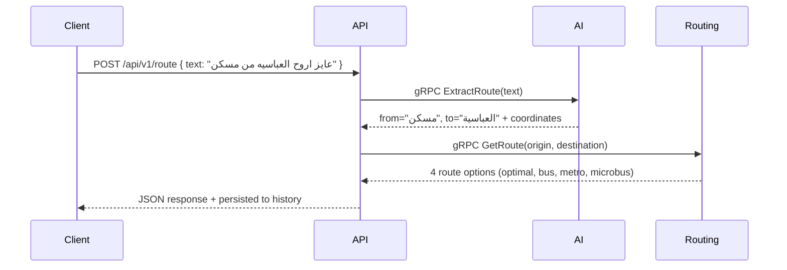
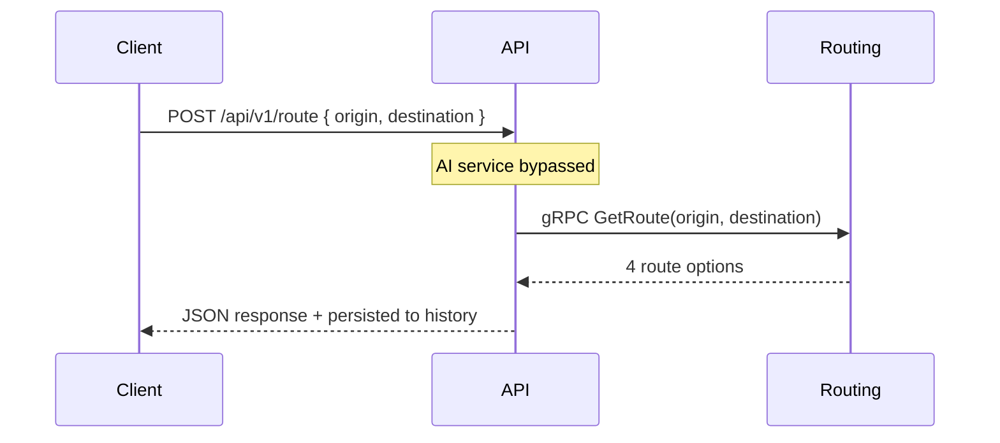
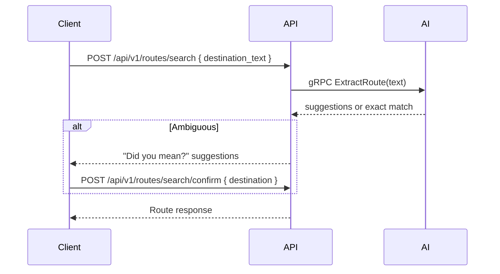

# Wslny — Smart Public Transit Routing for Greater Cairo

<!-- Badges -->


**Wslny** is a production-grade microservices platform that helps commuters navigate Greater Cairo's public transportation network (bus, microbus, metro). Users can describe their trip in natural Arabic/English text or drop map pins, and the system returns step-by-step routes with fare estimates, duration, distance, and map-ready polylines.

---

## 🗺️ Architecture Overview



### Service Responsibilities

| Service | Language | Port | Role |
|---------|----------|------|------|
| **Wslny API** | Python (Django + DRF) | 8000 | Public gateway: auth, orchestration, history, admin analytics |
| **AI Service** | Python (gRPC) | 50052 | NLP extraction + Google Maps geocoding (text flow only) |
| **RoutingEngine** | C++ (gRPC) | 50051 | A* pathfinding over GTFS transit graph (all flows) |

### Why This Architecture

| Decision | Rationale |
|----------|-----------|
| Single API gateway | Frontend only talks to one service — auth, validation, and security are centralized |
| gRPC between services | Lower latency than HTTP, strong typing via Protobuf contracts |
| C++ routing engine | Graph search is CPU-intensive — C++ gives deterministic low-latency responses |
| Separate AI service | NLP/geocoding complexity is isolated; map-pin requests skip it entirely |
| Redis caching | GTFS data and route results are cacheable; reduces DB/load on engine |
| PostgreSQL | User data, route history, analytics need relational queries and transactions |

---

## 🚀 Quick Start

### Prerequisites

- Docker + Docker Compose
- Google Maps API Key (for AI geocoding)

### Run the full stack

```bash
# Clone the repository
git clone https://github.com/AbanoubPhelopos/Wsnly-Backend.git
cd Wsnly-Backend

# Set required environment variable
export GOOGLE_MAPS_API_KEY=your_key_here

# Start all services
docker compose up --build
```

The API will be available at `http://localhost:8000`.

### Verify it's running

```bash
curl http://localhost:8000/api/health
```

### Explore the API

Open `http://localhost:8000/api/docs/` in your browser for the interactive Swagger UI.

---

## 🔄 Request Flows

### Text Flow (Natural Language)



### Map-Pin Flow (Coordinates Only)



### Search Flow (Destination Suggestions)



---

## 📡 API Endpoints

All versioned endpoints are prefixed with `/api/v1/`. Infrastructure endpoints (`/api/health`, `/api/schema/`, `/api/docs/`) are unversioned.

### Authentication

| Method | Endpoint | Auth | Description |
|--------|----------|------|-------------|
| POST | `/api/v1/auth/register` | Public | Register new user |
| POST | `/api/v1/auth/login` | Public | Email/password login |
| POST | `/api/v1/auth/google-login` | Public | Google OAuth login |
| GET | `/api/v1/auth/profile` | JWT | Get user profile |
| PUT | `/api/v1/auth/profile` | JWT | Update user profile |
| POST | `/api/v1/auth/change-password` | JWT | Change password |
| POST | `/api/v1/auth/refresh` | Refresh JWT | Refresh access token |

### Routing

| Method | Endpoint | Auth | Description |
|--------|----------|------|-------------|
| POST | `/api/v1/route` | JWT | Get route by text or coordinates |
| GET | `/api/v1/route/history` | JWT | User's route history |
| POST | `/api/v1/routes/search` | JWT | Search destination with suggestions |
| POST | `/api/v1/routes/search/confirm` | JWT | Confirm destination and get route |
| GET | `/api/v1/routes/metadata` | JWT | Filter options and transport methods |
| POST | `/api/v1/routes/alternatives` | JWT | All viable route alternatives |
| POST | `/api/v1/routes/feedback` | JWT | Submit route rating (1-5) |

### Transit Data

| Method | Endpoint | Auth | Description |
|--------|----------|------|-------------|
| GET | `/api/v1/stops/nearby?lat=&lon=&radius=` | JWT | Nearby stops with lines |
| GET | `/api/v1/stops/<stop_id>` | JWT | Stop detail with passing lines |
| GET | `/api/v1/lines` | JWT | All transit lines |
| GET | `/api/v1/lines/<route_id>` | JWT | Line detail with stops + polyline |

### User

| Method | Endpoint | Auth | Description |
|--------|----------|------|-------------|
| GET/POST | `/api/v1/user/saved-locations` | JWT | List / create saved locations |
| GET/PUT/DELETE | `/api/v1/user/saved-locations/<id>` | JWT | Retrieve / update / delete |
| GET/POST | `/api/v1/user/favorites` | JWT | List / create favorite routes |
| GET/DELETE | `/api/v1/user/favorites/<id>` | JWT | Retrieve / delete |
| GET/PUT | `/api/v1/user/preferences` | JWT | Get / update preferences |

### Admin

| Method | Endpoint | Auth | Description |
|--------|----------|------|-------------|
| POST | `/api/v1/admin/change-role` | Admin | Change user role |
| GET | `/api/v1/admin/users` | Admin | List all users |
| GET | `/api/v1/admin/users/<id>` | Admin | User detail + stats |
| PUT | `/api/v1/admin/users/<id>` | Admin | Update user profile/role/status |
| DELETE | `/api/v1/admin/users/<id>` | Admin | Deactivate user |
| GET | `/api/v1/admin/analytics/routes/overview` | Admin | Route analytics summary |
| GET | `/api/v1/admin/analytics/routes/top-routes` | Admin | Most requested O→D pairs |
| GET | `/api/v1/admin/analytics/routes/filters` | Admin | Filter usage statistics |
| GET | `/api/v1/admin/analytics/routes/unresolved` | Admin | Failed queries analysis |
| GET | `/api/v1/admin/analytics/routes/query` | Admin | Generic composable analytics |
| GET | `/api/v1/admin/analytics/users/overview` | Admin | User growth + activity |
| GET | `/api/v1/admin/analytics/feedback` | Admin | Feedback list with filters |
| GET | `/api/v1/admin/analytics/feedback/summary` | Admin | Rating distribution + averages |

### System

| Method | Endpoint | Auth | Description |
|--------|----------|------|-------------|
| GET | `/api/health` | Public | Health check (DB + gRPC deps) |
| GET | `/api/schema/` | Public | OpenAPI 3 schema |
| GET | `/api/docs/` | Public | Swagger UI |

---

## ✨ Features

### Authentication & User Management
- Email/password registration and login
- Google OAuth login
- JWT access + refresh tokens (60min / 24h)
- Profile view and update
- Password change
- Role-based access (User / Admin)

### Routing
- **Text input**: Arabic/English natural language → AI extracts locations → routing
- **Map pin input**: Coordinates go directly to routing engine (bypasses AI)
- **Route search**: Destination search with "Did you mean?" suggestions
- **Route alternatives**: All viable route options (bus, metro, microbus, optimal)
- **Route feedback**: Users rate routes 1–5 with optional comments
- **Filter types**: optimal, fastest, cheapest, bus_only, microbus_only, metro_only
- **Fare estimation**: Metro (tiered by stops), bus (20 EGP/ride), microbus (10 EGP/ride)
- **Map polylines**: GTFS shape data for drawing routes on maps

### Transit Data
- Nearby stops (with distance and connected lines)
- Stop detail (location + passing lines)
- All transit lines listing
- Line detail with ordered stops and full polyline

### User Features
- Saved locations (home, work, custom)
- Favorite routes with filter preference
- User preferences (default filter, max walk distance, accessibility mode)
- Route history

### Admin Analytics
- Route analytics overview (totals, source breakdown, averages, daily usage)
- Top requested routes (origin → destination pairs)
- Per-filter statistics
- Unresolved route queries with reason breakdown
- Generic analytics query (composable metrics, grouping, pagination)
- User management (detail, update, deactivate)
- User growth and activity overview
- Feedback analytics (list, summary, rating distribution)

### Infrastructure
- Redis caching with configurable TTL
- API versioning (`/api/v1/...`)
- Structured JSON logging
- Gunicorn with configurable workers/threads
- PostgreSQL connection pooling with health checks
- CORS with environment-based origins
- Rate limiting (30/min anonymous, 60/min authenticated)
- Health check endpoint (DB + gRPC dependency status)
- CI/CD pipeline (GitHub Actions)

---

## 🛠️ Tech Stack

| Category | Technology |
|----------|------------|
| **Backend** | Django 4.2, Django REST Framework, SimpleJWT |
| **Database** | PostgreSQL 15 (with connection pooling) |
| **Cache** | Redis 7 (via django-redis) |
| **Server** | Gunicorn (multi-worker, configurable threads) |
| **AI/NLP** | Custom NER model + rule-based fallback, Google Maps Geocoding API |
| **Routing** | C++ A* algorithm over GTFS graph |
| **Communication** | gRPC + Protobuf (HTTP/2) |
| **API Docs** | drf-spectacular (OpenAPI 3 + Swagger UI) |
| **Auth** | JWT (access + refresh tokens), Google OAuth |
| **CI/CD** | GitHub Actions (lint, syntax check, Docker build) |

---

## 📁 Project Structure

```
Wslny-Backend/
├── .github/workflows/ci.yml       # CI/CD pipeline
├── docker-compose.yml              # Multi-service orchestration
├── docs/                           # Comprehensive documentation
│   ├── architecture.md
│   ├── api-reference.md
│   ├── authentication.md
│   ├── routing.md
│   ├── ai-service.md
│   ├── routing-engine.md
│   ├── admin-analytics.md
│   ├── deployment.md
│   └── development.md
├── shared/protos/                  # gRPC Protobuf contracts
│   ├── routing.proto               # RoutingService definition
│   └── interpreter.proto           # TransitInterpreter definition
├── API/                            # Django REST API (Port 8000)
│   └── Wslny/
│       ├── Dockerfile
│       ├── gunicorn.conf.py
│       ├── entrypoint.sh
│       ├── manage.py
│       ├── requirements.txt
│       └── src/
│           ├── Core/               # Domain + Application (CQRS)
│           │   ├── Application/    # Admin, Auth, Transit services
│           │   └── Domain/        # Constants, Errors
│           ├── Infrastructure/     # gRPC clients, Models
│           └── Presentation/       # Views, URLs, Settings
├── Ai-Service/                     # Python gRPC NLP service (Port 50052)
│   ├── Server.py
│   ├── geocoder.py
│   └── TransitModel/               # NER model weights
└── RoutingEngine/                  # C++ gRPC routing service (Port 50051)
    ├── CMakeLists.txt
    ├── proto/routing.proto
    ├── include/                    # types.hpp, graph.hpp, pathfinder.hpp
    ├── src/                        # graph.cpp, pathfinder.cpp, service_impl.cpp
    └── Database/                   # GTFS CSV data (Cairo transit)
```

---

## 🔧 Environment Variables

### Wslny API (Django)

| Variable | Default | Description |
|----------|---------|-------------|
| `DJANGO_SECRET_KEY` | insecure default | Django secret key |
| `DEBUG` | `True` | Debug mode |
| `ALLOWED_HOSTS` | `*` | Comma-separated allowed hosts |
| `DB_NAME` | `wslny` | PostgreSQL database name |
| `DB_USER` | `postgres` | Database user |
| `DB_PASSWORD` | `postgres` | Database password |
| `DB_HOST` | `db` | Database host |
| `DB_PORT` | `5432` | Database port |
| `REDIS_URL` | `redis://redis:6379/0` | Redis connection URL |
| `AI_GRPC_HOST` | `ai-service` | AI service gRPC host |
| `AI_GRPC_PORT` | `50052` | AI service gRPC port |
| `ROUTING_GRPC_HOST` | `routing-engine` | Routing engine gRPC host |
| `ROUTING_GRPC_PORT` | `50051` | Routing engine gRPC port |
| `FARE_BUS_PER_RIDE` | `20` | Bus fare per ride (EGP) |
| `FARE_MICROBUS_PER_RIDE` | `10` | Microbus fare per ride (EGP) |
| `GUNICORN_WORKERS` | `4` | Number of Gunicorn workers |
| `GUNICORN_THREADS` | `2` | Threads per worker |
| `LOG_LEVEL` | `INFO` | Root log level |

### AI Service

| Variable | Description |
|----------|-------------|
| `GOOGLE_MAPS_API_KEY` | Required for geocoding |

### Routing Engine

| Variable | Default | Description |
|----------|---------|-------------|
| `GTFS_PATH` | `/app/Database` | Path to GTFS data files |

---

## 📊 GTFS Data

The routing engine loads Cairo's transit data from CSV files in `RoutingEngine/Database/`:

| File | Records | Description |
|------|---------|-------------|
| `stops.csv` | ~646 | Transit stop locations (lat/lon) |
| `routes.csv` | ~441 | Route definitions (bus, metro, microbus) |
| `trips.csv` | ~445 | Trips with shape references |
| `stop_times.csv` | — | Stop sequences per trip |
| `shapes.csv` | ~242,983 | Polyline points for route drawing |
| `agency.csv` | — | Transit agencies |
| `calendar.csv` | — | Service schedules |

Data is loaded once at startup into memory for fast A* queries. The Django API also reads GTFS data (cached via `@lru_cache`) for transit data endpoints.

---

## 📚 Documentation

Comprehensive documentation is available in the [`docs/`](docs/) folder:

| Document | Description |
|----------|-------------|
| [Architecture](docs/architecture.md) | System design, communication patterns, data flow |
| [API Reference](docs/api-reference.md) | Complete endpoint documentation with request/response examples |
| [Authentication](docs/authentication.md) | JWT flow, Google OAuth, roles, security |
| [Routing](docs/routing.md) | How routing works, filter types, fare calculation, polylines |
| [AI Service](docs/ai-service.md) | NLP extraction, geocoding, accuracy strategy |
| [Routing Engine](docs/routing-engine.md) | C++ implementation, A* algorithm, GTFS loading |
| [Admin & Analytics](docs/admin-analytics.md) | All admin endpoints and analytics capabilities |
| [Deployment](docs/deployment.md) | Docker setup, CI/CD, production configuration |
| [Development Guide](docs/development.md) | Project structure, conventions, adding features |

Per-service READMEs:

| README | Description |
|--------|-------------|
| `API/README.md` | API gateway overview |
| `API/Wslny/README.md` | Django runtime details |
| `Ai-Service/README.md` | AI service internals |
| `RoutingEngine/README.md` | Routing engine internals |
| `shared/protos/README.md` | gRPC contract definitions |

---

## 📄 License

This project is proprietary. All rights reserved.