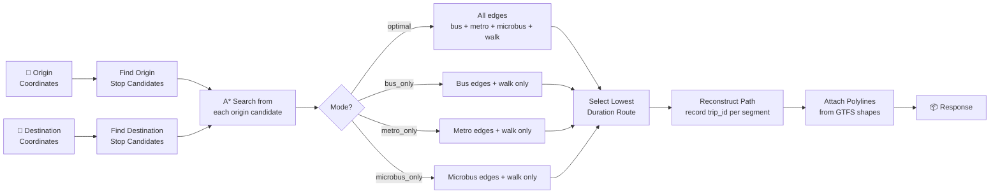

# RoutingEngine — C++ A* Transit Pathfinding

<!-- Badges -->


**RoutingEngine** is a high-performance C++ gRPC service that computes routes over Greater Cairo's public transit network using the A* algorithm on an in-memory GTFS graph.

> **Note**: RoutingEngine does **not** parse natural language. It operates exclusively on coordinates.

---

## 🎯 Responsibilities

- Load GTFS CSV data into an in-memory graph at startup
- Build transit edges (bus, metro, microbus) and walking transfer edges
- Compute candidate routes with A*-based search across multiple mode combinations
- Return multi-option routes with segments, metrics, and map polylines
- Shape point slicing between stops for accurate map drawing

---

## 🏗️ Architecture

```mermaid
graph TD
    subgraph Startup
        A[("📁 GTFS CSVs<br/>stops, routes, trips,<br/>stop_times, shapes")] --> B[Parse CSVs]
        B --> C[Build Graph<br/>nodes = stops<br/>edges = transit + walking]
        C --> D[Load Shape Polylines<br/>~242K points]
        D --> E[("✅ Ready<br/>Port 50051")]
    end

    subgraph Request
        F[("📍 Coordinates<br/>origin, destination")] --> G[Find Nearby Stops<br/>origin candidates<br/>destination candidates]
        G --> H[Run A* Search<br/>for each mode:<br/>optimal, bus, metro, microbus]
        H --> I[Build Segments<br/>start/end stops, method,<br/>distance, duration]
        I --> J[Attach Polylines<br/>slice GTFS shapes<br/>between stops]
        J --> K[("📦 RouteResponse<br/>4 route options<br/>with segments + polylines")]
    end
```



---

## 📊 Graph Structure

### Nodes (Stops)

Each transit stop becomes a graph node:
- ID, name, latitude, longitude
- Loaded from `stops.csv` (~646 stops)

### Edges

| Edge Type | Source | Weight | Attributes |
|-----------|--------|--------|------------|
| **Transit** | Sequential stops in same trip (stop_times.csv + trips.csv) | Travel time | route_id, trip_id, transport method |
| **Walking Transfer** | Stops within ~500m radius | Walking time | method = "walk" |

### Transport Mode Classification

| Source | Mode |
|--------|------|
| Route type 1 | Metro |
| Agency ID contains "METRO" | Metro |
| Agency ID starts with "MB_" | Microbus |
| Default | Bus |

---

## 🔍 A* Algorithm Details



### Heuristic

Haversine distance divided by a maximum speed constant. This gives an **optimistic estimate** that never overestimates actual travel time (admissible).

### Path Reconstruction

After A* finds the optimal path:
1. Trace back from destination to origin through parent pointers
2. Record each segment's: start/end stop, transport method, num stops, distance/duration, **trip_id**

---

## 🗺️ Polyline System

### Shape Loading

At startup, `graph.cpp::loadShapes()` reads all shape points into:
```cpp
std::unordered_map<shape_id, vector<ShapePoint>>
```
Sorted by sequence number.

### Trip-Shape Mapping

Each trip has a `shape_id` (from `trips.csv`). During pathfinding, segments store their `trip_id`, which maps to a `shape_id`.

### Polyline Slicing

In `service_impl.cpp::populatePolyline()`:
1. Get segment's `trip_id` → find its `shape_id` → load shape points
2. Find sequence numbers for segment's start and end stops
3. Slice shape points between those sequences
4. Attach resulting `{lat, lon}` array to `RouteSegment` proto

---

## 📁 Project Structure

```
RoutingEngine/
├── CMakeLists.txt          # CMake build (protobuf + grpc codegen)
├── Dockerfile              # Multi-stage build
├── proto/routing.proto     # Service definition (local copy)
├── include/
│   ├── types.hpp           # Data structures (Stop, Edge, ShapePoint)
│   ├── graph.hpp           # Graph class: loading, node/edge storage
│   └── pathfinder.hpp      # A* algorithm
├── src/
│   ├── graph.cpp           # GTFS parsing, graph building, shape loading
│   ├── pathfinder.cpp      # A* implementation with trip_id tracking
│   └── service_impl.cpp    # gRPC service + polyline population
├── Database/               # GTFS CSV data (Cairo transit)
│   ├── stops.csv           # ~646 stops
│   ├── routes.csv          # ~441 routes
│   ├── trips.csv           # ~445 trips
│   ├── stop_times.csv      # Sequential stop edges
│   ├── shapes.csv          # ~242,983 polyline points
│   ├── agency.csv          # Transit agencies
│   └── calendar.csv        # Service schedules
└── tools/
    └── validate_gtfs.py   # Data quality checker
```

---

## 📈 Performance Characteristics

| Metric | Value |
|--------|-------|
| **Startup** | ~1-2 seconds for Cairo dataset |
| **Per query** | Microseconds (small graph, ~646 nodes) |
| **Memory** | ~50MB for Cairo dataset (graph + shapes + indexes) |
| **Concurrency** | Single-threaded gRPC (sufficient for expected load) |

---

## 🔧 Configuration

| Variable | Default | Description |
|----------|---------|-------------|
| `GTFS_PATH` | `/app/Database` | Path to GTFS CSV files |

---

## 🚀 Running

**Recommended via root compose:**

```bash
docker compose up --build
```

**Standalone:**

```bash
docker build -t routing-engine RoutingEngine
docker run -p 50051:50051 -e GTFS_PATH=/app/Database routing-engine
```

---

## ✅ Data Quality Tool

```bash
python RoutingEngine/tools/validate_gtfs.py --db-path RoutingEngine/Database
```

**Checks:**
- Orphan stops (in `stops.csv` but not in `stop_times.csv`)
- Referential integrity (stop_ids, route_ids, trip_ids)
- Duplicate stop records
- Suspicious same-name clusters with large geographic spread

---

## 🧩 Why C++

| Reason | Explanation |
|--------|-------------|
| **Deterministic latency** | CPU-intensive graph search without garbage collection pauses |
| **Zero-copy access** | In-memory data structures with direct pointer access |
| **Cache-friendly** | Control over memory layout for hot path optimization |
| **Type-safe** | Easy integration with protobuf C++ codegen |