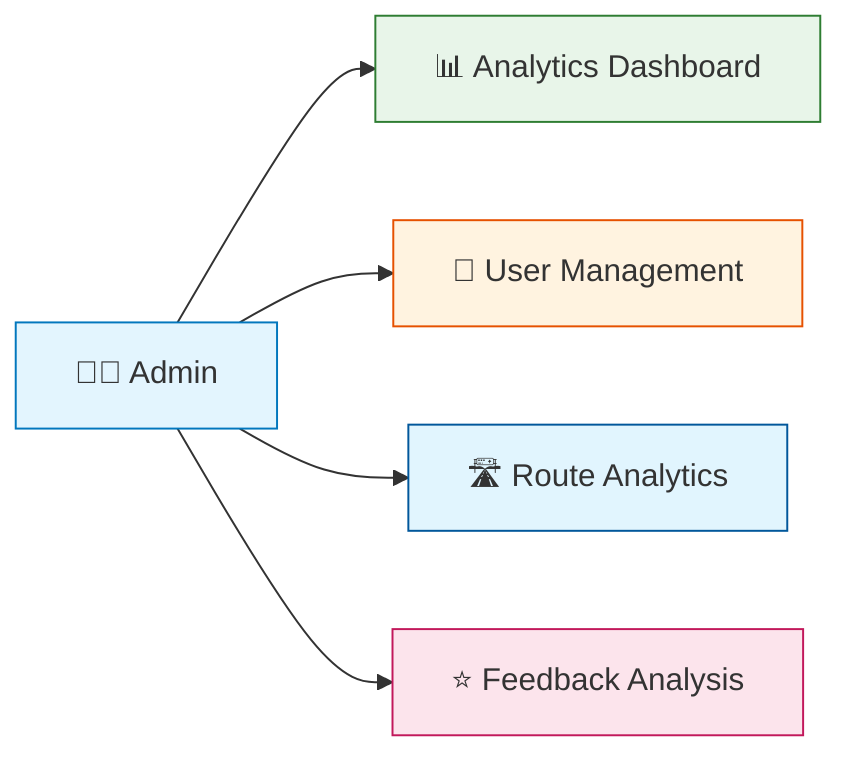
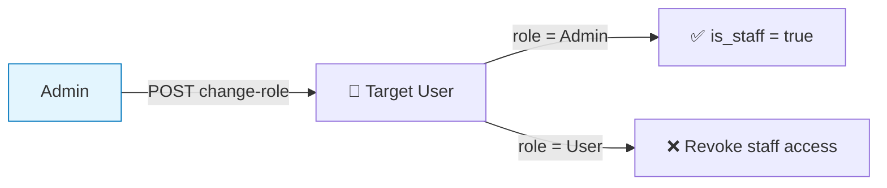
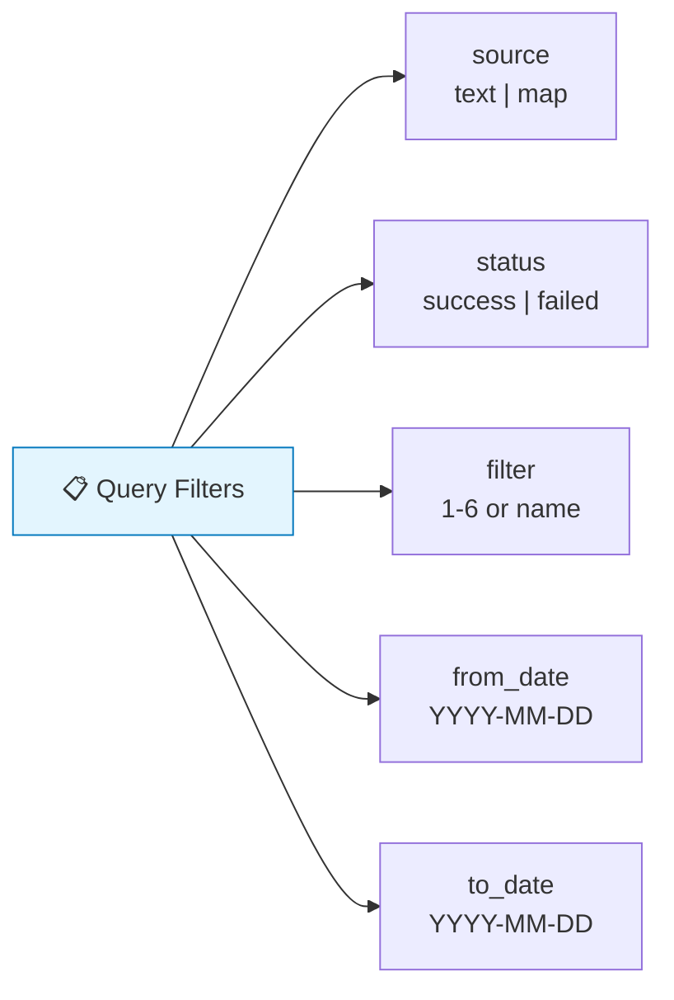
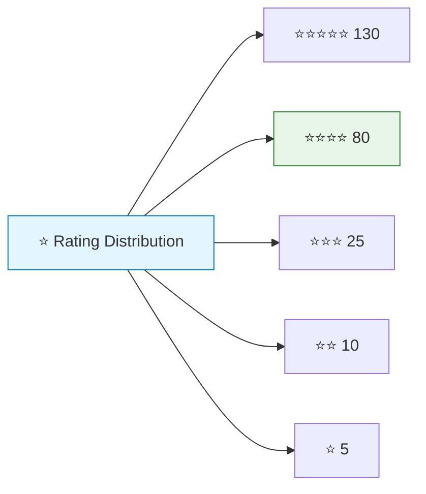

# Admin & Analytics

## Overview



The admin system provides **user management**, **route analytics**, and **feedback analysis** for platform operators.

> **Access Control**: All admin endpoints require the `Admin` role. The `IsAdminUser` permission class is enforced on every admin view.

---

## 👥 User Management

### List Users

```
GET /api/v1/admin/users
```

Returns all registered users with basic info (id, email, name, role).

### User Detail

```
GET /api/v1/admin/users/<id>
```

**Response:**
```json
{
  "id": 1,
  "email": "user@example.com",
  "first_name": "Ahmed",
  "last_name": "Ali",
  "mobile_number": "+201234567890",
  "role": "User",
  "is_active": true,
  "date_joined": "2024-01-15T10:30:00Z",
  "total_routes": 47,
  "saved_locations_count": 3,
  "favorite_routes_count": 2
}
```

### Update User

```
PUT /api/v1/admin/users/<id>
```

**Updatable fields:** `first_name`, `last_name`, `mobile_number`, `gender`, `address`, `role`, `is_active`

### Deactivate User

```
DELETE /api/v1/admin/users/<id>
```

Sets `is_active=False`. Prevents self-deactivation. User record is preserved for analytics.

### Change Role



```
POST /api/v1/admin/change-role
{ "user_id": 5, "new_role": "Admin" }
```

Valid roles: `Admin`, `User`. Changing to Admin automatically grants `is_staff` and `is_superuser`.

---

## 📊 Route Analytics

### Common Query Filters



| Parameter | Values | Description |
|-----------|--------|-------------|
| `source` | `text`, `map` | Filter by request source |
| `status` | `success`, `failed` | Filter by route status |
| `filter` | `1`-`6` or name | Filter by route preference |
| `from_date` | `YYYY-MM-DD` | Start date |
| `to_date` | `YYYY-MM-DD` | End date |

### Route Analytics Overview

```
GET /api/v1/admin/analytics/routes/overview
```

Returns aggregate statistics:

```json
{
  "totals": {
    "requests": 1500,
    "success": 1350,
    "failed": 150,
    "success_rate_percent": 90.0
  },
  "source_breakdown": {
    "text": 900,
    "map": 600
  },
  "averages": {
    "ai_latency_ms": 450.2,
    "routing_latency_ms": 120.5,
    "total_latency_ms": 580.7,
    "duration_seconds": 1800.0,
    "distance_meters": 7500.0
  },
  "daily_usage": [
    { "day": "2024-01-15", "total": 50 },
    { "day": "2024-01-16", "total": 65 }
  ]
}
```

### Top Routes

```
GET /api/v1/admin/analytics/routes/top-routes?limit=10
```

**Response:**
```json
{
  "top_routes": [
    {
      "origin_name": "مسكن",
      "destination_name": "العباسية",
      "requests": 85,
      "avg_duration_seconds": 1800,
      "avg_distance_meters": 7500
    }
  ]
}
```

### Filter Statistics

```
GET /api/v1/admin/analytics/routes/filters
```

**Response:**
```json
{
  "filter": {
    "name": "optimal",
    "requests": 800,
    "avg_duration_seconds": 1700,
    "avg_fare": 25.0,
    "success_rate_percent": 92.5
  }
}
```

### Unresolved Queries

```
GET /api/v1/admin/analytics/routes/unresolved
```

**Response:**
```json
{
  "unresolved_reasons": [
    { "unresolved_reason": "no_nearby_stops", "count": 45 },
    { "unresolved_reason": "destination_not_found", "count": 30 }
  ],
  "long_walk_count": 25,
  "top_unresolved_queries": [
    { "input_text": "روح المحكمة", "error_code": "DESTINATION_NOT_FOUND", "count": 8 }
  ]
}
```

### Generic Analytics Query

```
GET /api/v1/admin/analytics/routes/query
```

**The most flexible analytics endpoint.** Supports composable queries:

| Parameter | Description |
|-----------|-------------|
| `metrics` | Comma-separated: `requests`, `success_count`, `failed_count`, `success_rate_percent`, `avg_total_latency_ms`, etc. |
| `group_by` | Comma-separated: `day`, `week`, `source`, `status`, `filter`, `selected_route_type` |
| `sort` | Sort field from metrics or group_by |
| `order` | `asc` or `desc` |
| `limit` | Page size (1-200) |
| `offset` | Page offset |

**Example:**
```
GET /api/v1/admin/analytics/routes/query?metrics=requests,success_rate_percent&group_by=day&sort=day&order=asc&limit=30
```

---

## 👤 User Analytics

### User Overview

```
GET /api/v1/admin/analytics/users/overview
```

**Response:**
```json
{
  "totals": {
    "total_users": 250,
    "active_users": 230,
    "inactive_users": 20,
    "admin_users": 3,
    "users_with_routes": 180,
    "avg_routes_per_user": 6.5
  },
  "growth": [
    { "day": "2024-01-15", "count": 5 },
    { "day": "2024-01-16", "count": 8 }
  ],
  "top_users_by_routes": [
    {
      "user__email": "commuter@example.com",
      "user__first_name": "Ahmed",
      "route_count": 150,
      "success_count": 140
    }
  ]
}
```

---

## ⭐ Feedback Analytics

### Feedback List

```
GET /api/v1/admin/analytics/feedback?min_rating=3&from_date=2024-01-01&limit=20
```

**Response:**
```json
{
  "feedback": [
    {
      "id": 1,
      "user_id": 5,
      "user_email": "user@example.com",
      "request_id": "a1b2c3d4-...",
      "rating": 4,
      "comment": "Route was accurate",
      "created_at": "2024-01-15T10:30:00Z"
    }
  ],
  "pagination": { "total": 85, "limit": 20, "offset": 0 }
}
```

**Filters:** `min_rating`, `max_rating`, `user_id`, `from_date`, `to_date`

### Feedback Summary

```
GET /api/v1/admin/analytics/feedback/summary
```

**Response:**
```json
{
  "total_feedback": 250,
  "average_rating": 4.2,
  "rating_distribution": {
    "1": 5,
    "2": 10,
    "3": 25,
    "4": 80,
    "5": 130
  }
}
```

---

## 📈 Rating Distribution



Average rating: **4.2** based on 250 feedback entries.