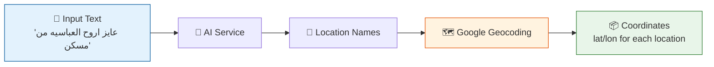
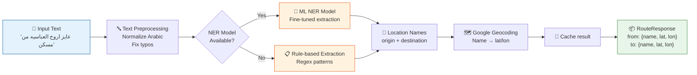
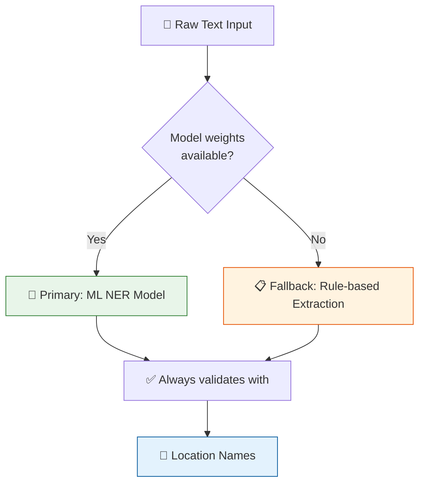
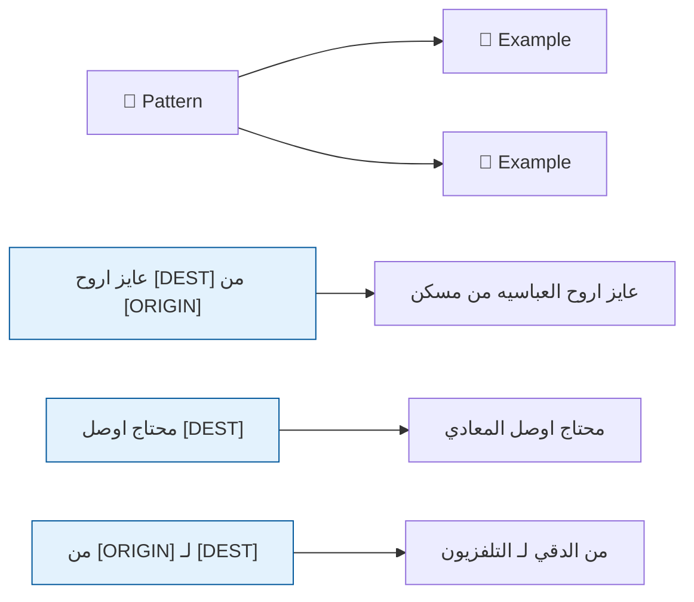
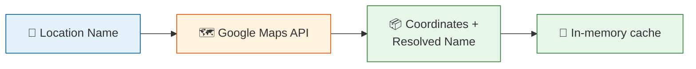
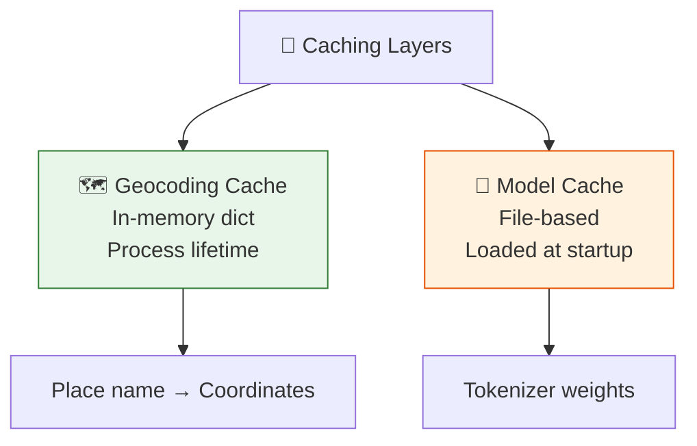
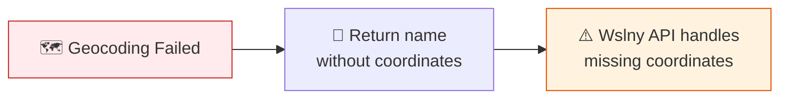
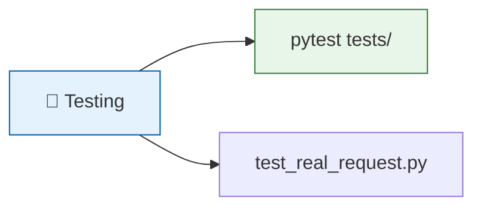
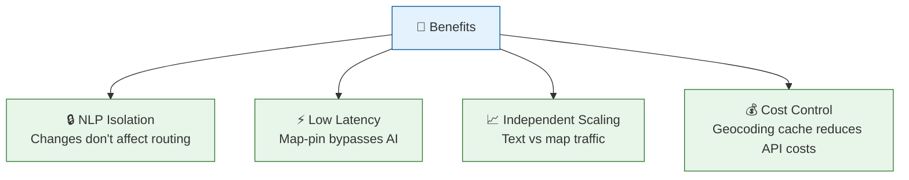

# AI Service

## Overview

The **AI Service** is a Python gRPC microservice that extracts origin and destination locations from natural language text (Arabic/English) and geocodes them to coordinates using Google Maps.



> **Note**: AI Service does **not** calculate routes. Pathfinding is handled by `RoutingEngine`.

---

## How It Works

### Two-Stage Pipeline



---

## Stage 1: Named Entity Recognition

### Two-Layer Approach



| Layer | Strategy | When Used |
|-------|----------|-----------|
| **ML NER** | Fine-tuned model in `TransitModel/` | Primary when weights exist |
| **Rule-based** | Regex patterns for Arabic/English phrases | Always active (fallback) |
| **Alias normalization** | Maps typos/colloquial names to canonical forms | In rule-based pipeline |

### Common Arabic Patterns



---

## Stage 2: Geocoding



- Extracted location names → Google Maps Geocoding API
- Results **cached in-memory** to reduce API calls for repeated place names
- Returns coordinates + resolved name

---

## Destination-Only Requests

```mermaid
sequenceDiagram
    participant C as Client
    participant A as Wslny API
    participant AI as AI Service

    C->>A: "محطة مترو المنيب"
    A->>AI: ExtractRoute(text)
    AI-->>A: {
      from_location: "",
      from_coordinates: null,
      to_location: "محطة مترو المنيب",
      to_coordinates: { lat: 30.01, lon: 31.25 },
      intent: "standard"
    }
    Note over A: Use client's current_location as origin
    A-->>C: Route response
```

The service can return a valid result with only a destination. The Wslny API uses the client's `current_location` as the origin.

---

## gRPC Contract

**Service**: `TransitInterpreter`
**RPC**: `ExtractRoute(RouteRequest) -> RouteResponse`
**Proto source**: `shared/protos/interpreter.proto`

```protobuf
service TransitInterpreter {
  rpc ExtractRoute (RouteRequest) returns (RouteResponse) {}
}

message RouteRequest {
  string text = 1;
}

message RouteResponse {
  string from_location = 1;
  string to_location = 2;
  Location from_coordinates = 6;
  Location to_coordinates = 7;
  string intent = 8;
}
```

---

## Input/Output Examples

### Full Extraction (Origin + Destination)

**Input:**
```json
{ "text": "عايز اروح العباسيه من مسكن" }
```

**Output:**
```json
{
  "from_location": "مسكن",
  "to_location": "العباسية",
  "from_coordinates": { "latitude": 30.05, "longitude": 31.34 },
  "to_coordinates": { "latitude": 30.07, "longitude": 31.28 },
  "intent": "standard"
}
```

### Destination Only

**Input:**
```json
{ "text": "محطة مترو المنيب" }
```

**Output:**
```json
{
  "from_location": "",
  "to_location": "محطة مترو المنيب",
  "from_coordinates": null,
  "to_coordinates": { "latitude": 30.01, "longitude": 31.25 },
  "intent": "standard"
}
```

---

## Project Structure

```
Ai-Service/
├── Server.py              # gRPC server entrypoint (port 50052)
├── geocoder.py            # Google Maps geocoding + in-memory cache
├── TransitModel/          # NER model weights (gitignored)
│   ├── tokenizer.json
│   └── tokenizer_config.json
├── protos/                # Local proto copy for Docker build
├── tests/
│   └── test_flow.py       # Regression tests for Arabic phrases
├── Dockerfile
└── Requirements.txt
```

---

## Caching Strategy



| Cache | Type | What | Lifetime |
|-------|------|------|----------|
| **Geocoding** | In-memory dict | Place name → coordinates | Process lifetime |
| **Model** | File-based | NER tokenizer weights | Loaded at startup |

---

## Error Handling



If geocoding fails for a location, the service returns the location name without coordinates. The Wslny API handles missing coordinates by returning an error to the client.

---

## Testing



```bash
# Run tests inside Docker
docker compose exec ai-service python -m pytest tests/

# Test a real request
docker compose exec ai-service python test_real_request.py
```

---

## Accuracy Strategy

| Layer | Strategy |
|-------|----------|
| ML NER | Fine-tuned model in `TransitModel/` — used when weights available |
| Rule-based | Regex patterns for common Arabic/English location expressions — always active |
| Alias normalization | Maps frequent typos and colloquial names to canonical forms |
| Geocoding cache | Reduces API calls for repeated place names |
| Regression tests | `tests/test_flow.py` covers critical Arabic phrases |

---

## Why This Service Is Separate



| Benefit | Explanation |
|---------|-------------|
| **NLP isolation** | NLP complexity doesn't affect pathfinding stability |
| **Map-pin bypass** | Map-pin requests skip AI entirely for lower latency |
| **Independent scaling** | Text vs. map traffic can be managed separately |
| **Cost control** | Geocoding cache reduces Google Maps API costs |

---

## Environment

| Variable | Required | Description |
|----------|----------|-------------|
| `GOOGLE_MAPS_API_KEY` | **Yes** | Google Maps Geocoding API key |