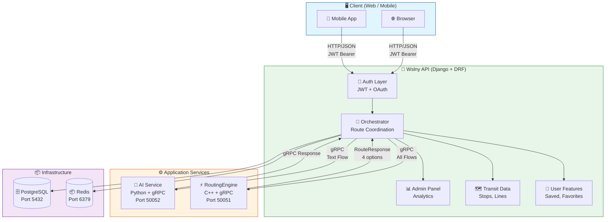
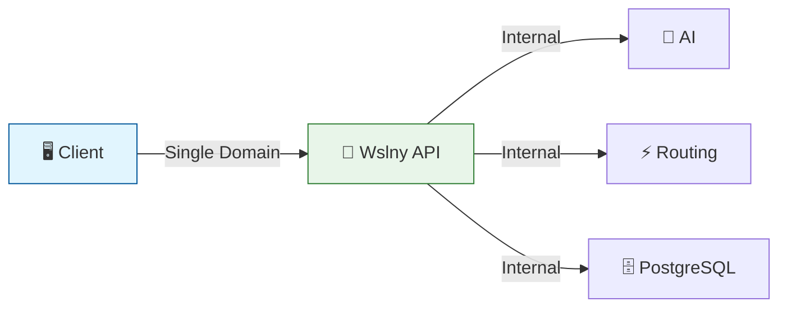
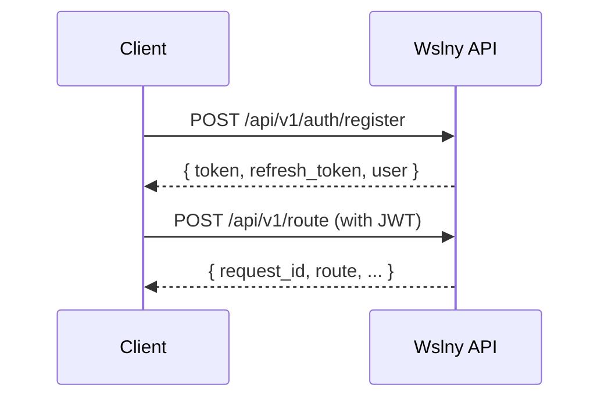
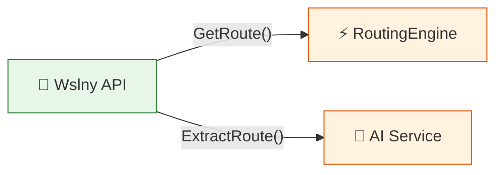
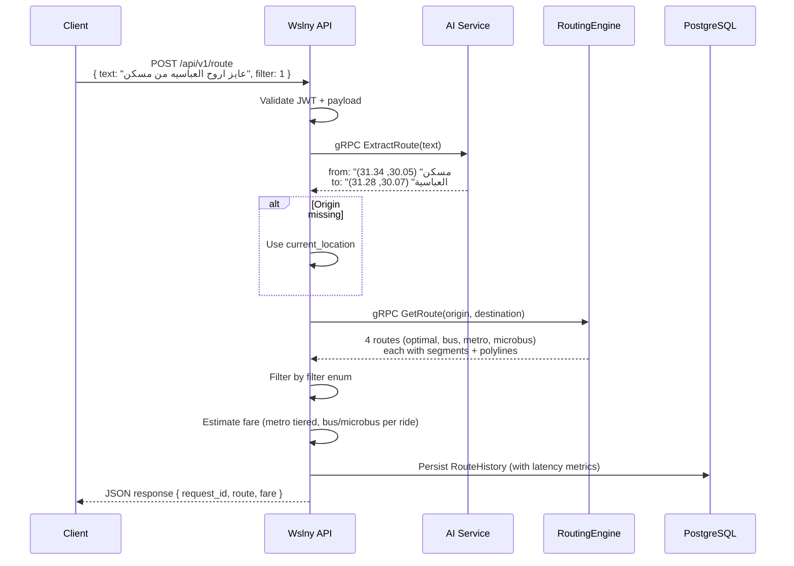
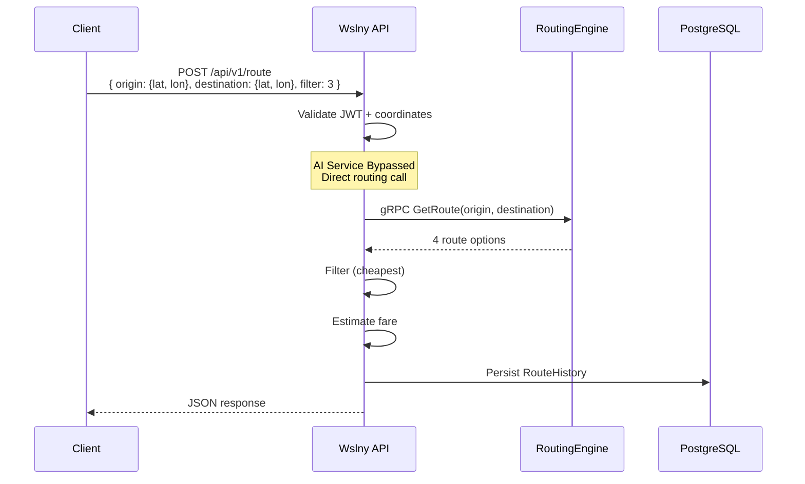
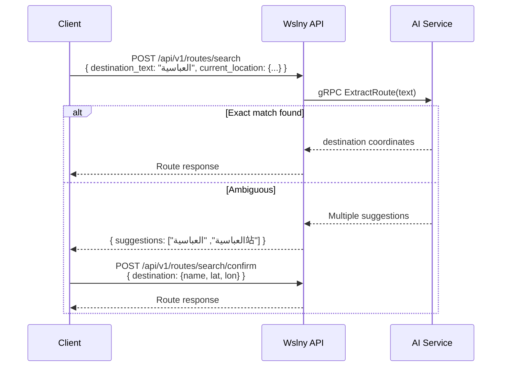
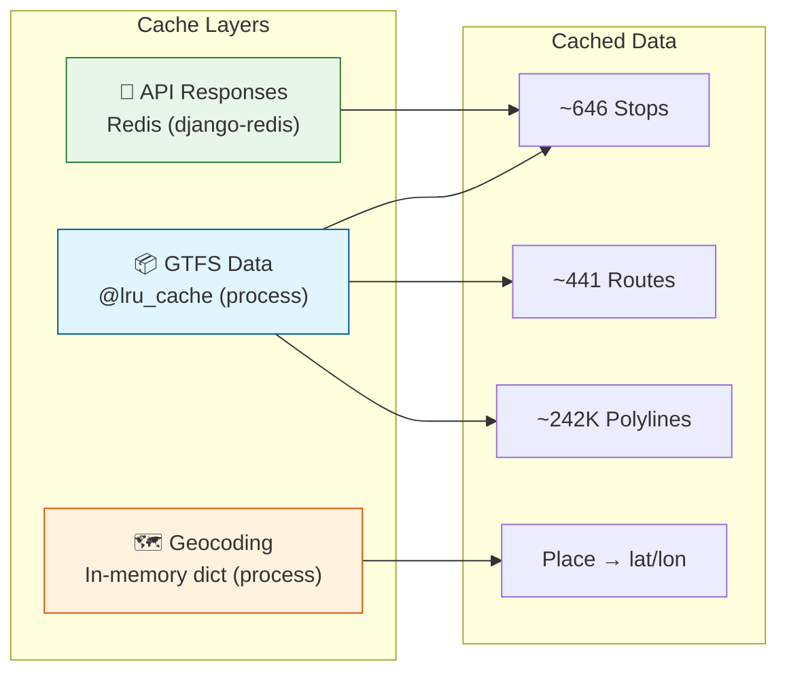
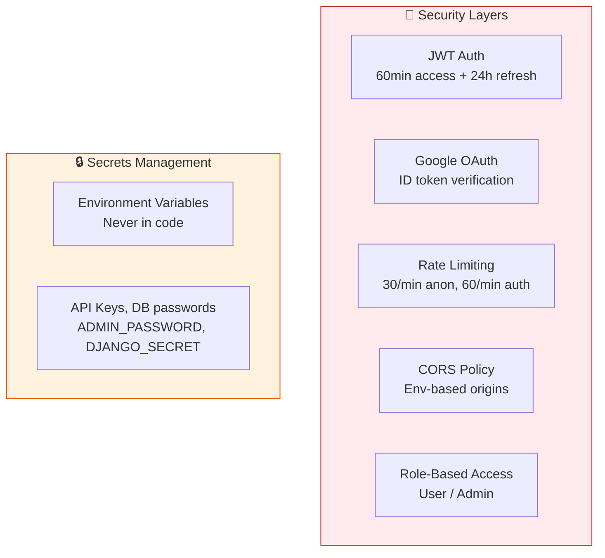

# Architecture

## System Overview

Wslny is a **polyglot microservices platform** with three application services and two infrastructure services, orchestrated behind a single Django API gateway.



---

## Design Principles

### 1. Single Entry Point

All client requests go through the **Wslny API**. Frontends **never** call AI or routing services directly.



**Benefits of Single Gateway:**
- Authentication & authorization centralized
- Input validation in one place
- Error handling uniform across all endpoints
- Request history & analytics unified
- Rate limiting at one point
- Security enforcement consolidated

### 2. Separation of Concerns

| Service | Responsibility | Does NOT Do |
|---------|---------------|-------------|
| **Wslny API** | Auth, orchestration, persistence, analytics | NLP, pathfinding |
| **AI Service** | NLP extraction, geocoding | Routing, user data |
| **RoutingEngine** | A* pathfinding over GTFS | NLP, HTTP, user data |

### 3. Clean Architecture / DDD-lite (Django API)

```mermaid
graph TD
    subgraph Presentation["📡 Presentation Layer"]
        VIEWS[🖥️ Views<br/>API endpoints]
        URLS[🔗 URL Routing]
        SCHEMAS[📋 Serializers<br/>Swagger docs]
        PERMS[🔐 Permissions<br/>IsAdminUser]
    end

    subgraph Core["🏛️ Core (Business Logic)"]
        APP[📦 Application<br/>Use Cases (CQRS)]
        DOMAIN[📐 Domain<br/>Constants, Errors]
    end

    subgraph Infrastructure["🧱 Infrastructure"]
        GRPC[📡 gRPC Clients<br/>Thread-safe singletons]
        MODELS[🗄️ Models<br/>Django ORM]
    end

    VIEWS -->|"Commands/Queries"| APP
    APP --> DOMAIN
    VIEWS --> GRPC
    APP --> MODELS

    style Presentation fill:#e1f5fe,stroke:#01579b
    style Core fill:#e8f5e9,stroke:#2e7d32
    style Infrastructure fill:#fff3e0,stroke:#e65100
```

---

## Communication Patterns

### Client ↔ API: HTTP/JSON + JWT



### API ↔ Services: gRPC (HTTP/2 + Protobuf)



**Why gRPC?**
| Benefit | Description |
|---------|-------------|
| **Binary serialization** | Smaller payloads, faster than JSON |
| **Strong typing** | `.proto` contracts prevent schema drift |
| **Code generation** | Python + C++ from same proto files |
| **HTTP/2 multiplexing** | Reduced connection overhead |

---

## Data Flow

### Text Route Request



### Map Route Request



### Search + Confirm Flow



---

## Database Schema

### Users & Identity

```mermaid
erDiagram
    User {
        int id PK
        string email UK
        string first_name
        string last_name
        string mobile_number
        string gender
        string address
        string role
        bool is_active
        bool is_staff
        datetime date_joined
    }

    SavedLocation {
        int id PK
        int user_id FK
        string name
        float lat
        float lon
        string type
        datetime created_at
    }

    FavoriteRoute {
        int id PK
        int user_id FK
        string name
        float origin_lat
        float origin_lon
        float destination_lat
        float destination_lon
        string origin_name
        string destination_name
        int route_filter
        datetime created_at
    }

    UserPreferences {
        int id PK
        int user_id FK UK
        int default_filter
        int max_walk_distance
        bool accessibility_mode
    }

    User ||--o{ SavedLocation : "has"
    User ||--o{ FavoriteRoute : "has"
    User ||--|| UserPreferences : "has"
```

### History & Analytics

```mermaid
erDiagram
    RouteHistory {
        int id PK
        uuid request_id UK INDEX
        int user_id FK NULL
        string source_type
        string input_text
        int preference
        string selected_route_type
        string origin_name
        float origin_lat
        float origin_lon
        string destination_name
        float destination_lat
        float destination_lon
        string status
        string error_code
        string error_message
        float total_distance_meters
        int total_duration_seconds
        int step_count
        float estimated_fare
        int walk_distance_meters
        bool has_result
        string unresolved_reason
        float ai_latency_ms
        float routing_latency_ms
        float total_latency_ms
        datetime created_at INDEX
    }

    RouteFeedback {
        int id PK
        int user_id FK
        uuid request_id INDEX
        int rating
        string comment
        datetime created_at
    }

    User ||--o{ RouteHistory : "generates"
    User ||--o{ RouteFeedback : "submits"
    RouteHistory ||--|| RouteFeedback : "has"
```

---

## Caching Strategy



| Layer | Technology | What's Cached | TTL |
|-------|-----------|---------------|-----|
| **GTFS data** | Python `@lru_cache` | Stops, routes, trips, stop_times, shapes | Process lifetime |
| **API responses** | Redis (django-redis) | Configurable per endpoint | 300s (routes), 86400s (GTFS) |
| **Geocoding** | Python in-memory | Place name → coordinates | Process lifetime |

---

## Security Architecture



| Concern | Implementation |
|---------|---------------|
| **Authentication** | JWT (access 60min + refresh 24h) |
| **OAuth** | Google ID token verification |
| **Authorization** | Role-based (User / Admin) via `IsAdminUser` |
| **Rate limiting** | 30/min anonymous, 60/min authenticated |
| **CORS** | Configurable origins via env var |
| **Secrets** | All via environment variables (never in code) |
| **Password** | PBKDF2 hashing, change requires current password |

---

## Error Handling

```mermaid
graph LR
    subgraph Errors["Error Codes"]
        E1["INVALID_REQUEST_MODE<br/>Both text & coords provided"]
        E2["INVALID_COORDINATES<br/>Missing or non-numeric"]
        E3["AI_EXTRACTION_FAILED<br/>AI couldn't extract locations"]
        E4["ROUTING_ERROR<br/>Routing engine error"]
        E5["NO_ROUTES_FOUND<br/>No viable route between points"]
        E6["DESTINATION_AMBIGUOUS<br/>Multiple matches for text"]
    end

    subgraph Response["Standard Error Response"]
        JSON["""request_id": "uuid"<br/>"error": {<br/>  "code": "...",<br/>  "message": "..."<br/>}"]
    end

    E1 & E2 & E3 & E4 & E5 & E6 --> JSON

    style Errors fill:#ffebee,stroke:#c62828
    style Response fill:#e1f5fe,stroke:#01579b
```

All route requests (success and failure) are recorded in `RouteHistory` with latency metrics for observability.

---

## Environment Variables

| Category | Variable | Default | Description |
|----------|----------|---------|-------------|
| **Security** | `DJANGO_SECRET_KEY` | insecure | Django secret key |
| **Security** | `DEBUG` | True | Debug mode |
| **Security** | `ALLOWED_HOSTS` | * | Comma-separated hosts |
| **Database** | `DB_NAME` | wslny | PostgreSQL database |
| **Database** | `DB_USER` | postgres | Database user |
| **Database** | `DB_PASSWORD` | postgres | Database password |
| **Database** | `DB_HOST` | db | Database host |
| **gRPC** | `AI_GRPC_HOST` | ai-service | AI service host |
| **gRPC** | `AI_GRPC_PORT` | 50052 | AI service port |
| **gRPC** | `ROUTING_GRPC_HOST` | routing-engine | Routing engine host |
| **gRPC** | `ROUTING_GRPC_PORT` | 50051 | Routing engine port |
| **Cache** | `REDIS_URL` | redis://redis:6379/0 | Redis connection |
| **Fares** | `FARE_BUS_PER_RIDE` | 20 | Bus fare (EGP) |
| **Fares** | `FARE_MICROBUS_PER_RIDE` | 10 | Microbus fare (EGP) |
| **Fares** | `FARE_METRO_UP_TO_9` | 8 | Metro ≤9 stops |
| **Server** | `GUNICORN_WORKERS` | 4 | Gunicorn workers |
| **Server** | `GUNICORN_THREADS` | 2 | Threads per worker |