# Authentication & Security

## Overview

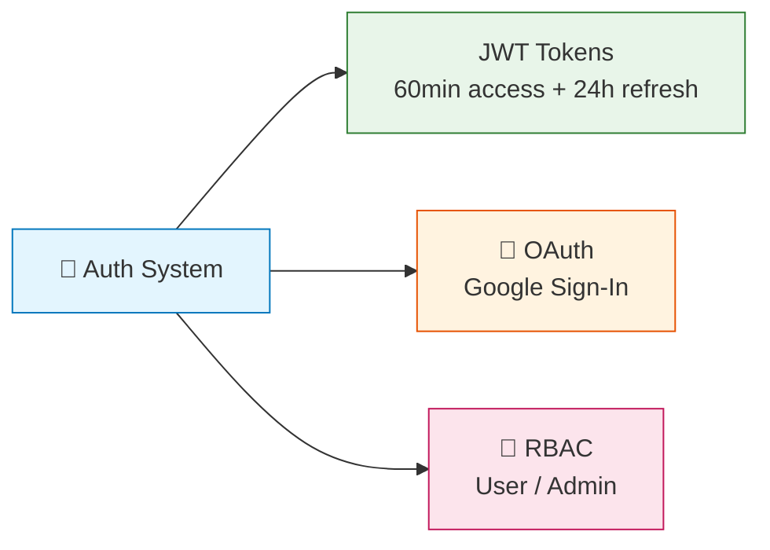

Wslny uses **JWT (JSON Web Tokens)** for authentication with **role-based access control**. All protected endpoints require a valid Bearer token.

---

## 🔑 Authentication Methods

### Email/Password

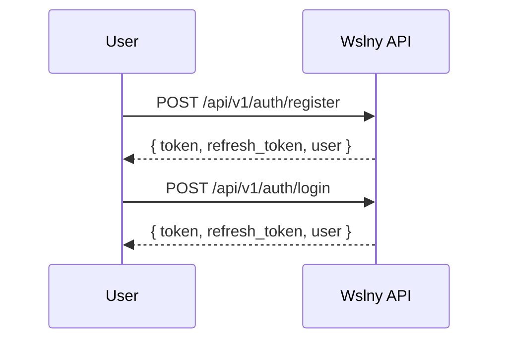

1. **Register**: `POST /api/v1/auth/register` with email, password, name, phone
2. **Login**: `POST /api/v1/auth/login` with email and password
3. Both return `{ token, refresh_token, user }`

### Google OAuth

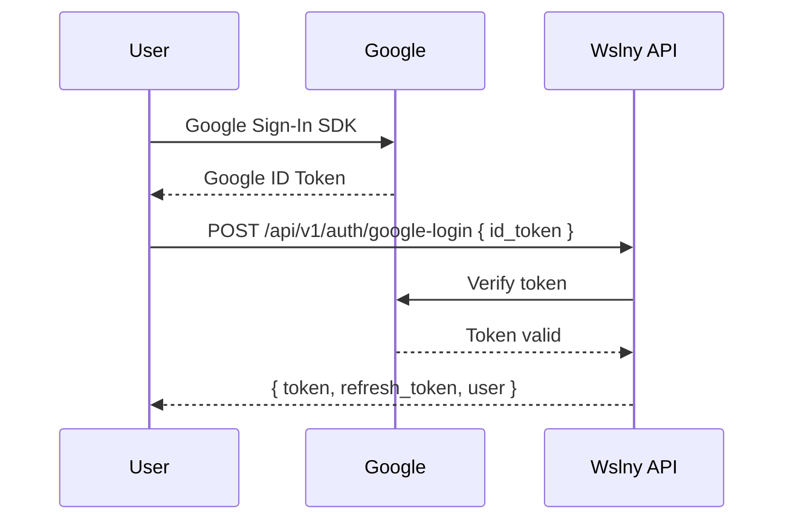

1. Client obtains Google ID token from Google Sign-In SDK
2. `POST /api/v1/auth/google-login` with `id_token`
3. Server verifies token with Google, creates user if new, returns JWT

---

## 🔐 JWT Configuration

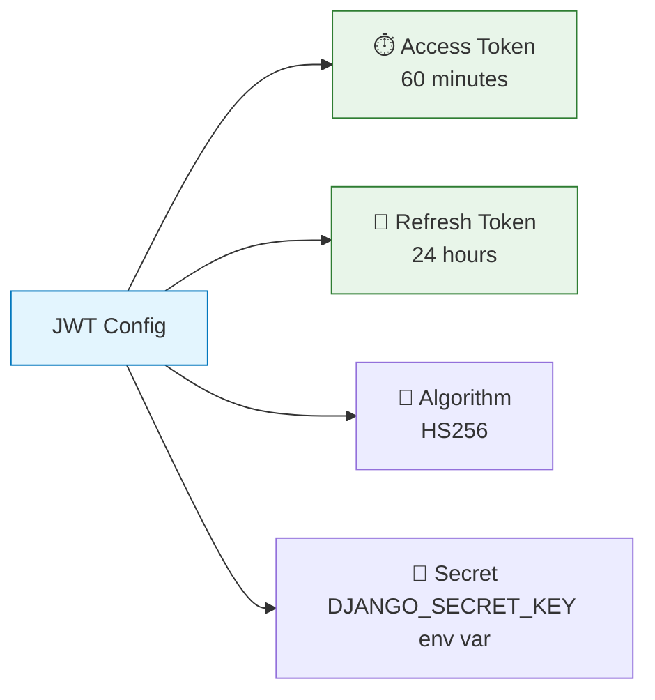

| Setting | Value |
|---------|-------|
| Access token lifetime | 60 minutes |
| Refresh token lifetime | 24 hours |
| Algorithm | HS256 |
| Secret | From `DJANGO_SECRET_KEY` env var |

### Token Refresh

```
POST /api/v1/auth/refresh
Body: { "refresh": "<refresh_token>" }
```

Returns a new access token. Refresh tokens themselves are **not rotated**.

---

## 👥 Roles

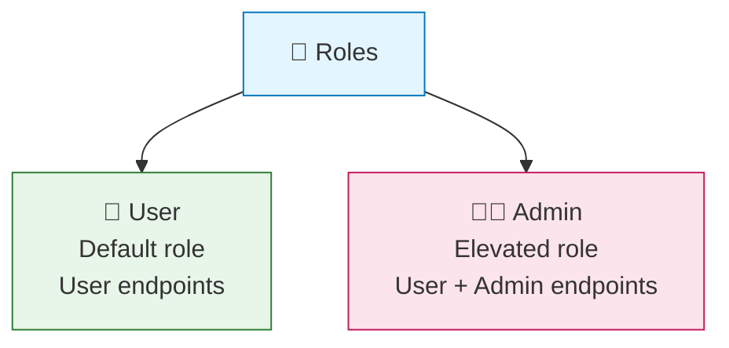

| Role | Description | Access |
|------|-------------|--------|
| `User` | Default role | All user endpoints |
| `Admin` | Elevated role | All user + admin endpoints |

### Role Assignment

- New users get `User` role by default
- Admin role is assigned via `POST /api/v1/admin/change-role` (admin-only)
- Initial admin is seeded on startup with password from `ADMIN_PASSWORD` env var

### Admin Check

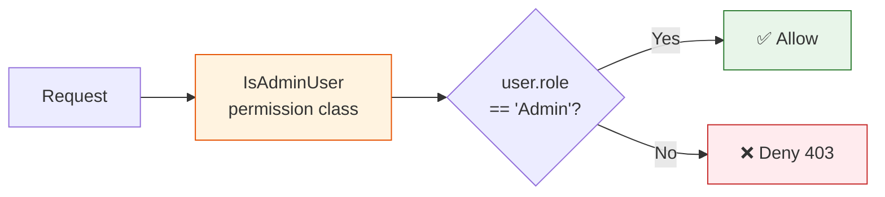

The `IsAdminUser` permission class checks `request.user.role == "Admin"`. Enforced at the view level.

---

## 🔓 Public vs Protected Endpoints

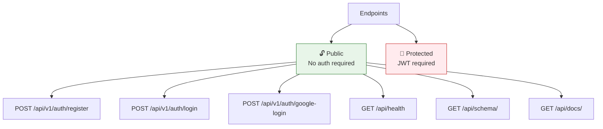

**Public endpoints** (no authentication required):
- `POST /api/v1/auth/register`
- `POST /api/v1/auth/login`
- `POST /api/v1/auth/google-login`
- `GET /api/health`
- `GET /api/schema/`
- `GET /api/docs/`

---

## 🛡️ Security Measures

### Secrets Management

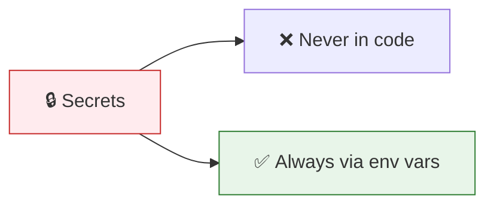

All sensitive values are read from environment variables:
- `DJANGO_SECRET_KEY`
- `DB_PASSWORD`
- `ADMIN_PASSWORD`
- `GOOGLE_MAPS_API_KEY`

### CORS Configuration

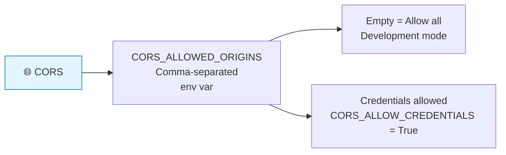

Configured via `django-cors-headers`:
- `CORS_ALLOWED_ORIGINS`: Comma-separated list of allowed origins (env var)
- If empty, all origins are allowed (development mode)
- Credentials are allowed (`CORS_ALLOW_CREDENTIALS = True`)

### Rate Limiting

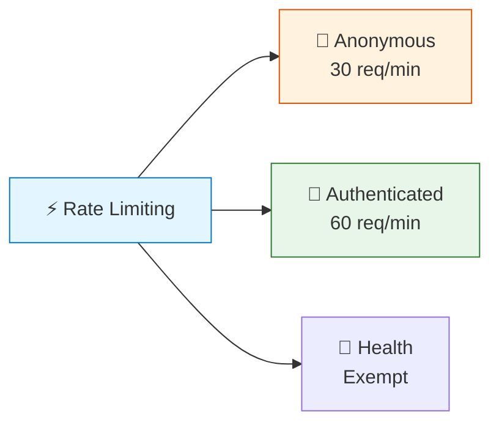

Using Django REST Framework's built-in throttling:

| User Type | Limit |
|-----------|-------|
| Anonymous | 30 requests/minute |
| Authenticated | 60 requests/minute |
| Health endpoint | **Exempt** |

### Password Security

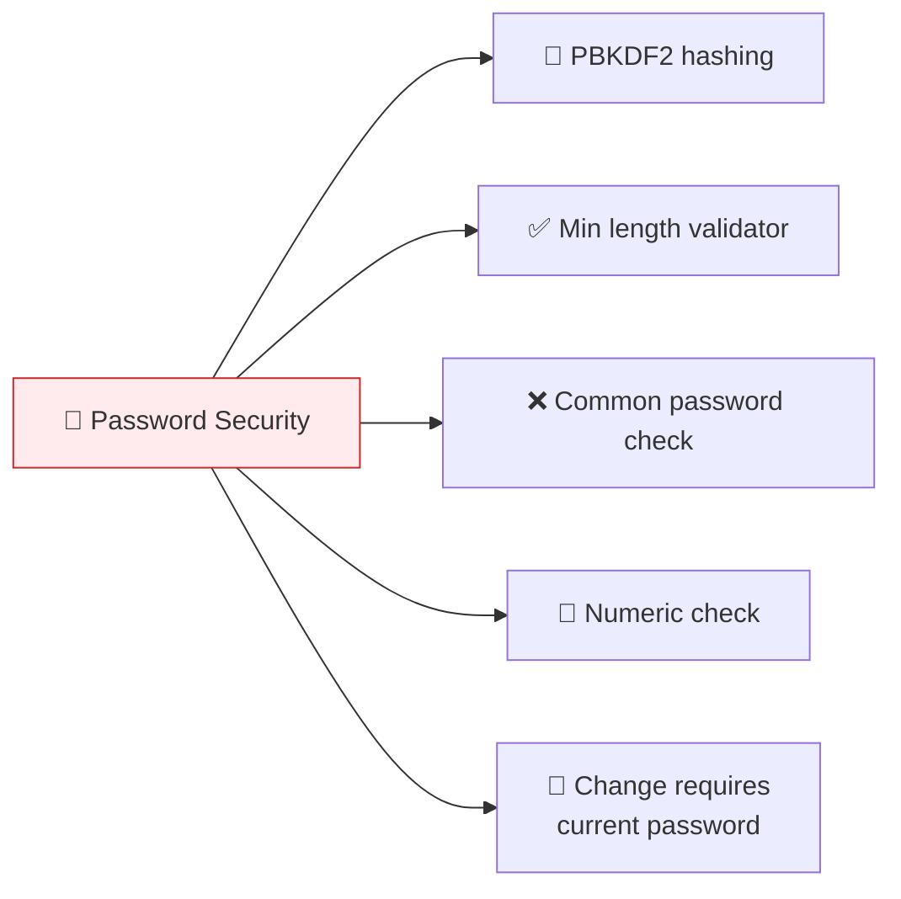

- Passwords are hashed using Django's built-in password hashing (PBKDF2)
- Password validators enforce minimum length, common password check, numeric check
- Password change requires current password verification

### Input Validation

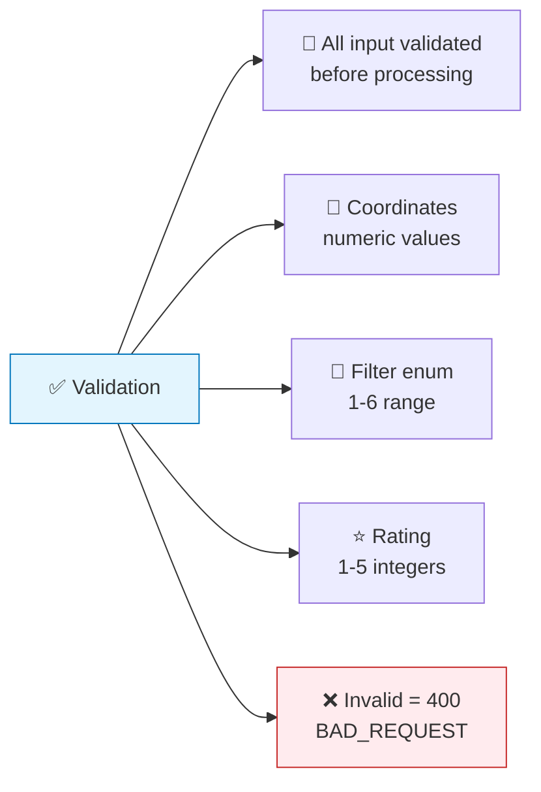

- All input is validated at the view level before processing
- Coordinates are validated as numeric values
- Filter enum values are validated against the allowed range (1-6)
- Rating values are validated as integers between 1 and 5
- Invalid input returns `400 BAD_REQUEST` with descriptive error messages