# Deployment Guide

## 🐳 Docker Compose (Recommended)

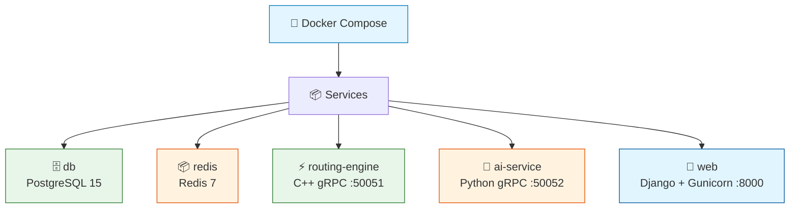

### Quick Start

```bash
# Clone
git clone https://github.com/AbanoubPhelopos/Wsnly-Backend.git
cd Wsnly-Backend

# Set required env vars
export GOOGLE_MAPS_API_KEY=your_key_here
export ADMIN_PASSWORD=your_secure_admin_password

# Build and start
docker compose up --build

# Verify
curl http://localhost:8000/api/health
```

---

## 🔄 Service Dependencies

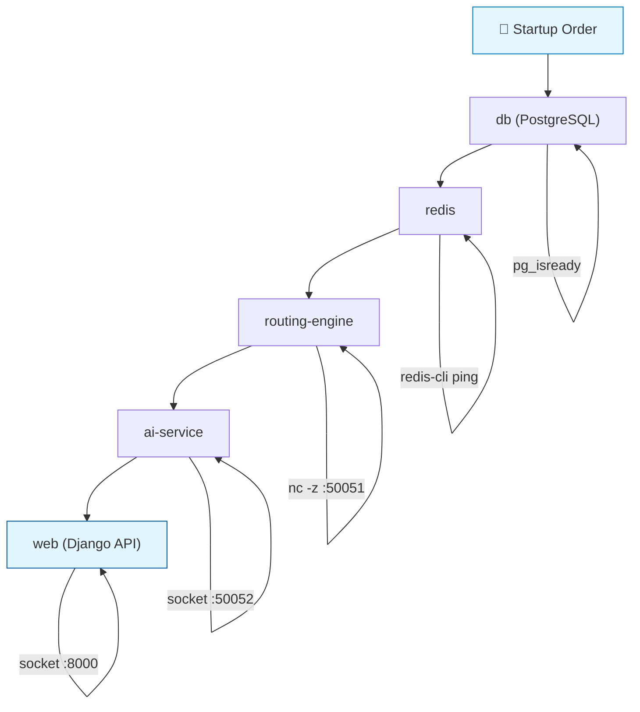

Each service has a health check:
- `db`: `pg_isready`
- `redis`: `redis-cli ping`
- `routing-engine`: `nc -z` on port 50051
- `ai-service`: Python socket connection on port 50052
- `web`: Python socket connection on port 8000

---

## ⚙️ Production Configuration

### Environment Variables

Create a `.env` file or set environment variables:

```bash
# Security (REQUIRED)
DJANGO_SECRET_KEY=your-long-random-secret-key
DEBUG=False
ALLOWED_HOSTS=api.yourdomain.com
ADMIN_PASSWORD=secure-admin-password

# Database
DB_NAME=wslny
DB_USER=postgres
DB_PASSWORD=secure-db-password
DB_HOST=db
DB_PORT=5432
DB_CONN_MAX_AGE=60

# gRPC Services
AI_GRPC_HOST=ai-service
AI_GRPC_PORT=50052
ROUTING_GRPC_HOST=routing-engine
ROUTING_GRPC_PORT=50051

# Redis
REDIS_URL=redis://redis:6379/0

# CORS
CORS_ALLOWED_ORIGINS=https://yourdomain.com,https://app.yourdomain.com

# Gunicorn
GUNICORN_WORKERS=4
GUNICORN_THREADS=2
GUNICORN_TIMEOUT=120

# Logging
LOG_LEVEL=INFO
APP_LOG_LEVEL=INFO

# AI Service
GOOGLE_MAPS_API_KEY=your-google-maps-key
```

---

## 🚀 Gunicorn Configuration

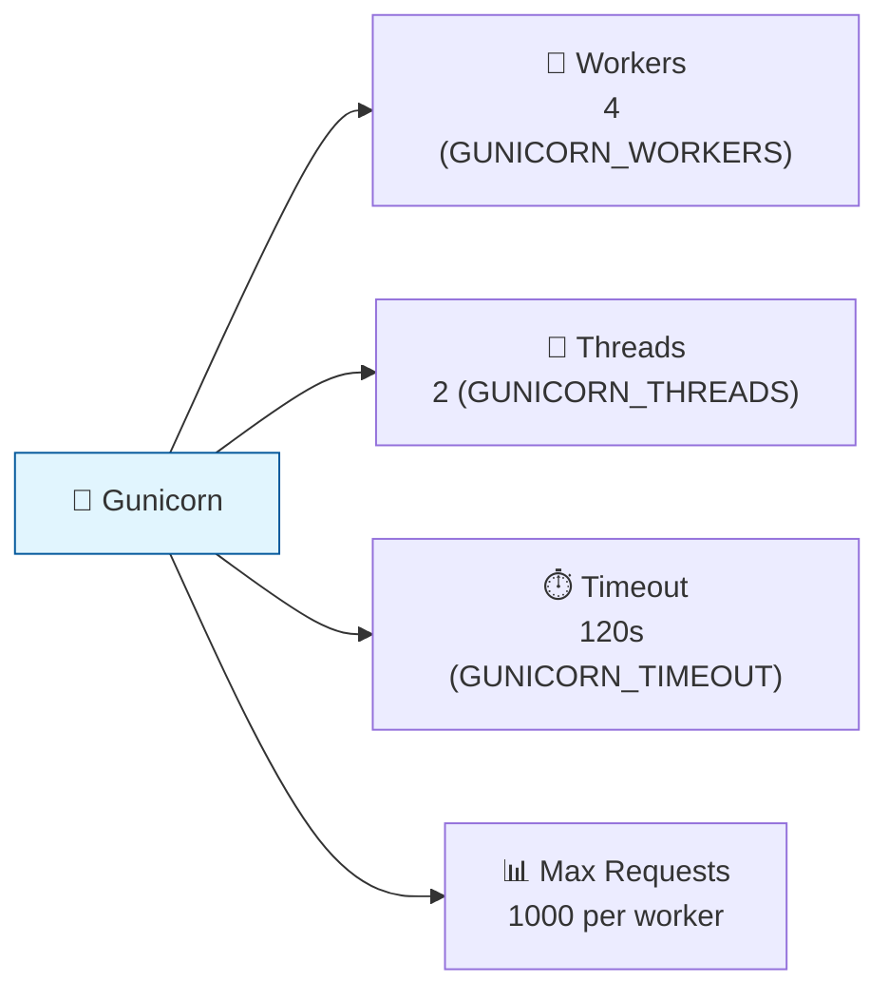

```python
# gunicorn.conf.py
workers = 4        # GUNICORN_WORKERS env var
threads = 2        # GUNICORN_THREADS env var
timeout = 120      # GUNICORN_TIMEOUT env var
max_requests = 1000    # Restart workers after 1000 requests (prevents memory leaks)
max_requests_jitter = 100  # Randomize to prevent all workers restarting at once
```

**Rule of thumb**: `(2 × CPU cores) + 1` workers.

---

## 🗄️ Database Connection Pooling

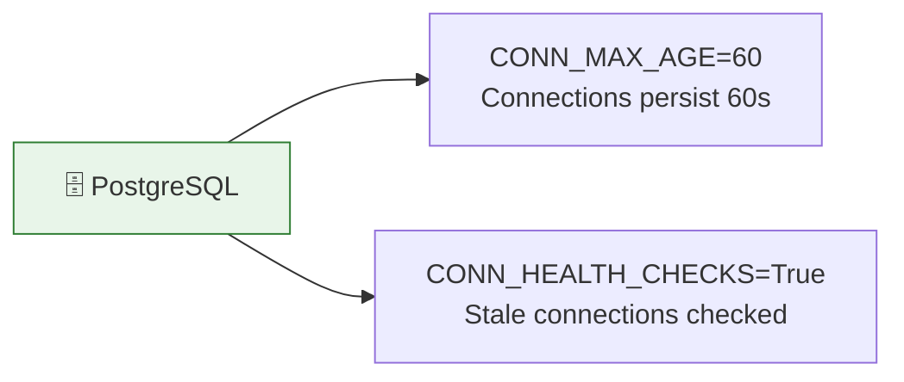

- `CONN_MAX_AGE=60` — Connections persist for 60 seconds
- `CONN_HEALTH_CHECKS=True` — Stale connections are checked before use

---

## 📦 Redis Caching

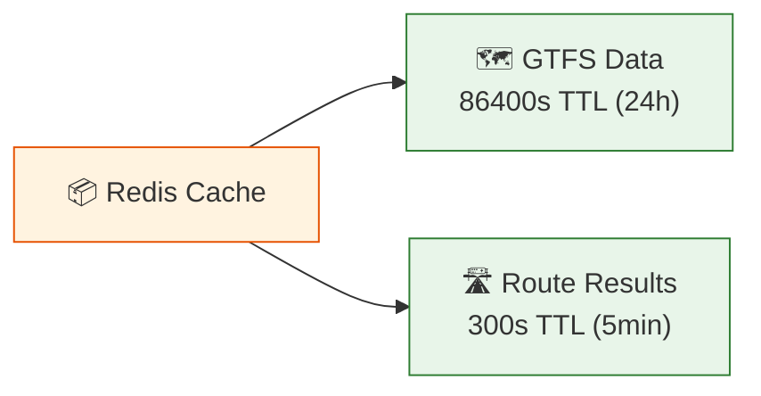

- `GTFS_CACHE_TIMEOUT=86400` (24 hours for static transit data)
- `ROUTE_CACHE_TIMEOUT=300` (5 minutes for route results)

---

## 📋 Structured Logging

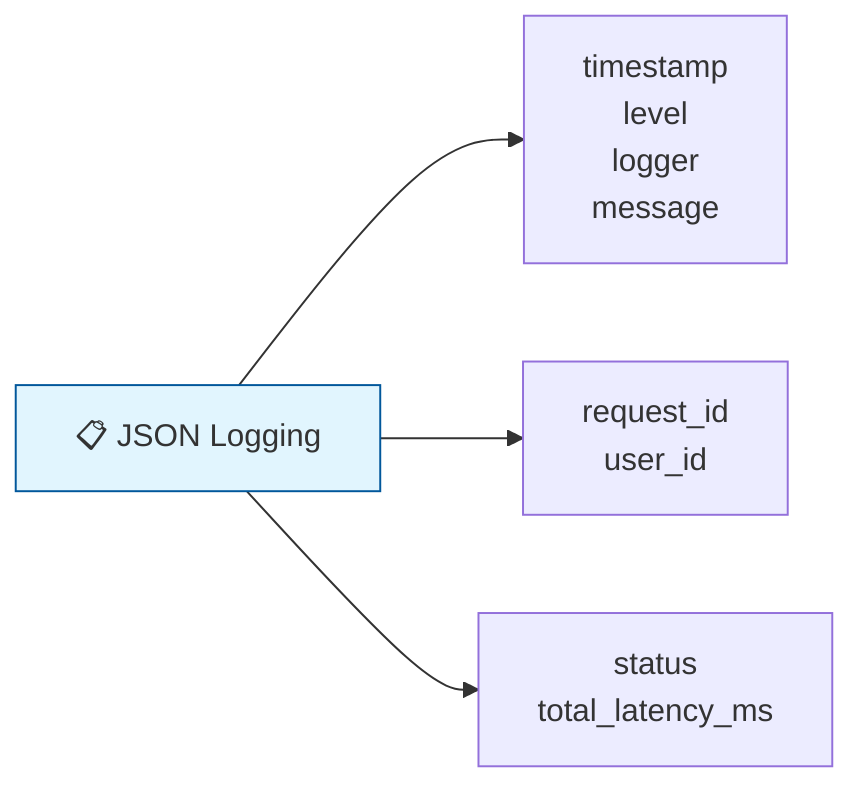

All logs are JSON-formatted for production log aggregation:

```json
{
  "timestamp": "2024-01-15T10:30:00.000Z",
  "level": "INFO",
  "logger": "src.Presentation.views.orchestrator",
  "message": "Route request completed",
  "request_id": "a1b2c3d4-...",
  "user_id": 5,
  "status": "success",
  "total_latency_ms": 580.7
}
```

---

## 🔄 CI/CD Pipeline

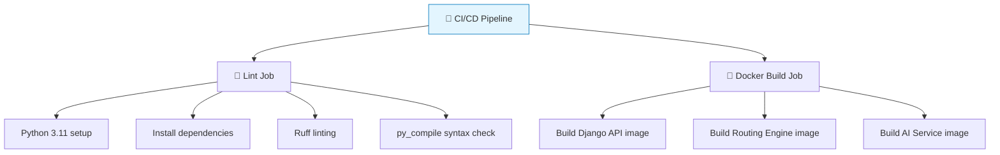

GitHub Actions runs on every push/PR to `main`:
- **Lint Job**: Python 3.11 setup, dependencies, Ruff linting, py_compile syntax check
- **Docker Build Job**: Builds all three service images

The workflow file is at `.github/workflows/ci.yml`.

---

## 🚀 Startup Process

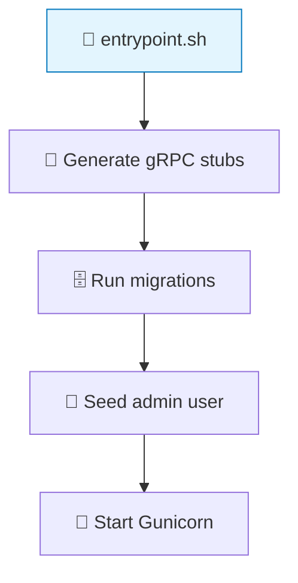

The Django API's `entrypoint.sh` runs on container start:

1. Generate gRPC Python stubs from proto files
2. Run database migrations (`python manage.py migrate`)
3. Seed admin user (`python manage.py seed_admin`)
4. Start Gunicorn (`gunicorn -c gunicorn.conf.py`)

**Admin seeded with:**
- Email: `admin@wslny.com`
- Password: from `ADMIN_PASSWORD` env var
- Role: Admin

---

## 📈 Scaling Considerations

### Horizontal Scaling

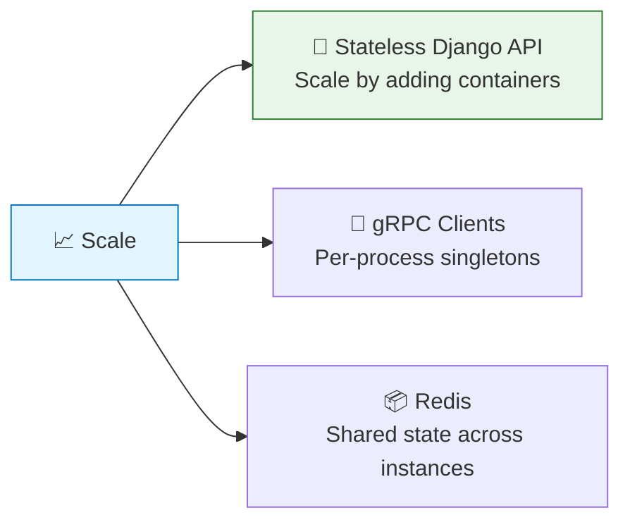

- Django API is **stateless** — scale by adding more web containers
- gRPC client singletons are per-process (each Gunicorn worker has its own)
- Redis provides shared state across API instances

### Database

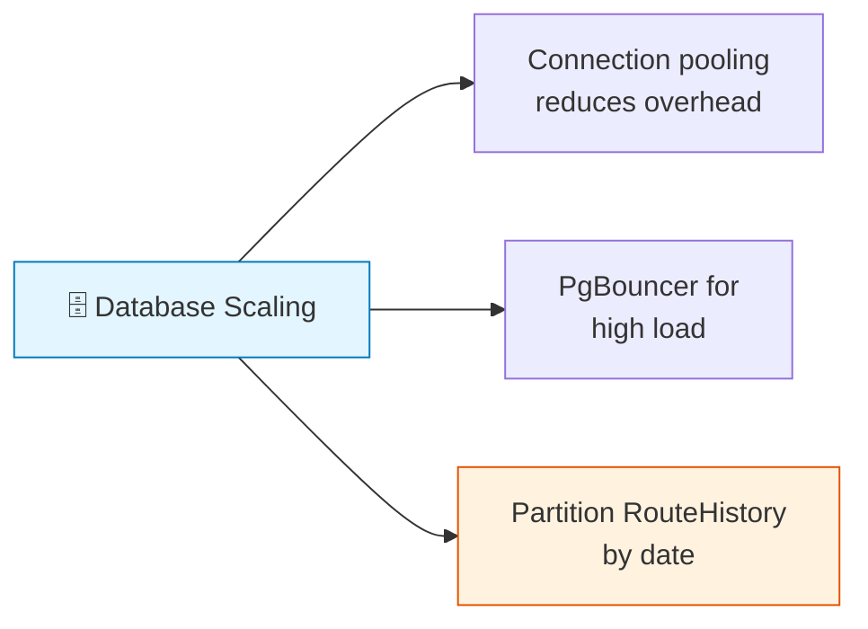

- PostgreSQL connection pooling reduces connection overhead
- For high load, consider PgBouncer as a connection pooler
- Route history can grow large — consider partitioning by date

### GTFS Data

- Loaded once at routing engine startup (~242K shape points, ~646 stops)
- GTFS data changes infrequently — engine restart required for updates
- Django API also caches GTFS data in-process via `@lru_cache`

### Cache Invalidation

| Cache | Invalidation |
|-------|---------------|
| GTFS cache | Cleared on process restart |
| Route cache | TTL-based (5 minutes default) |
| Geocoding cache | In-process, cleared on AI service restart |

---

## 📊 Monitoring

### Health Check

```bash
curl http://localhost:8000/api/health
```

Returns status of all dependencies (database, AI service, routing engine).

### Metrics from Route History

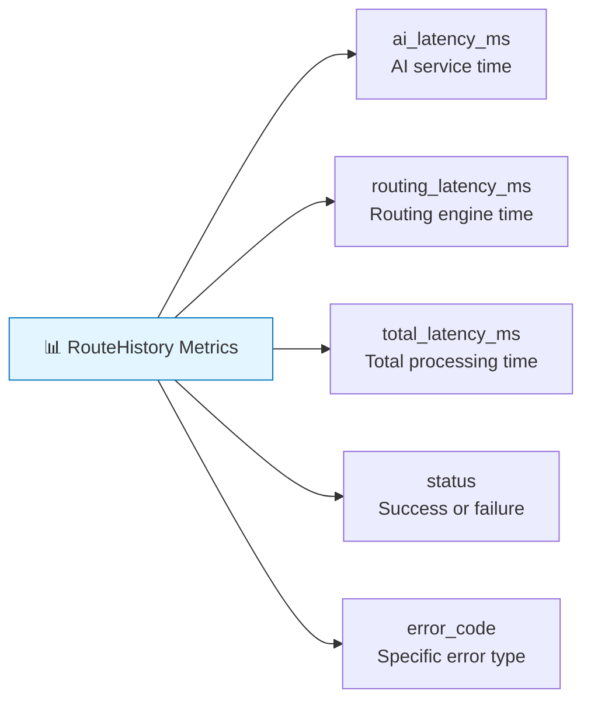

The `RouteHistory` model records per-request metrics. Queryable via admin analytics endpoints.

### API Documentation

Interactive API documentation at `http://localhost:8000/api/docs/`. Supports JWT authorization for testing protected endpoints.