# Development Guide

## 🏗️ Project Conventions

### Architecture

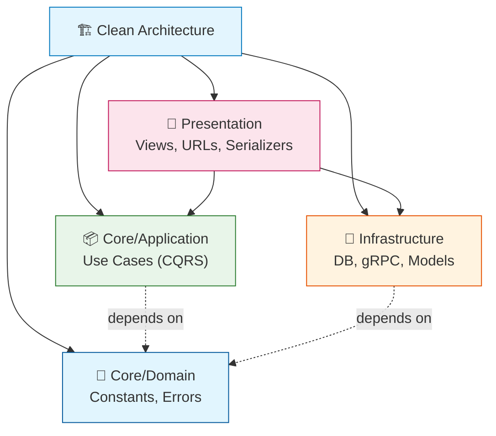

```
Core/          → Domain logic, no framework dependencies
  Application/ → Use cases (CQRS: Commands + Queries)
  Domain/      → Constants, errors, interfaces
Infrastructure/ → External concerns (DB, gRPC, models)
Presentation/  → API layer (views, URLs, serializers, settings)
```

**Dependency rule**: Presentation → Application → Domain ← Infrastructure

---

## 🎨 Code Style

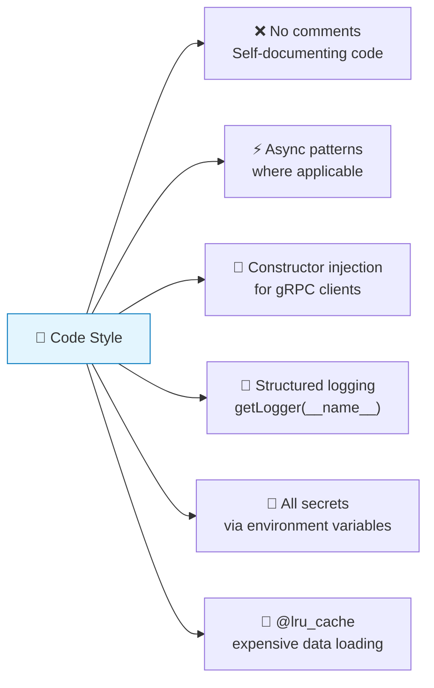

- No comments in production code (self-documenting code preferred)
- Async patterns where applicable
- Constructor injection for gRPC clients (lazy initialization in views)
- Structured logging via `logging.getLogger(__name__)`
- All secrets via environment variables — never hardcoded
- `@lru_cache` for expensive data loading (GTFS)

---

## 🔄 CQRS Pattern

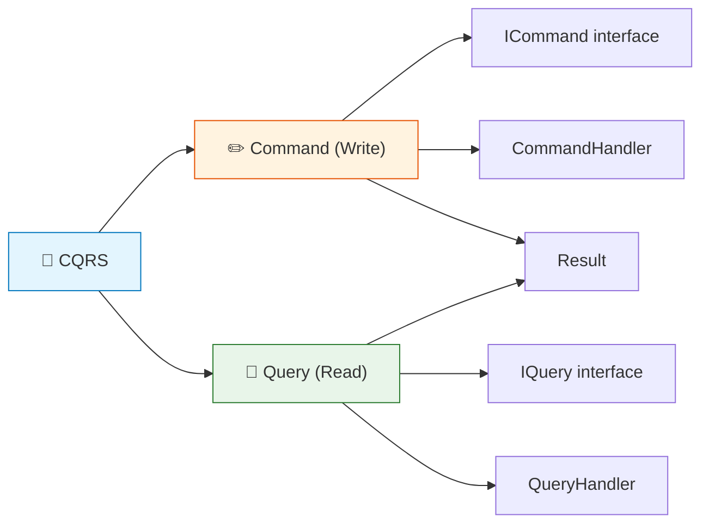

**Used for write operations and complex queries:**

```python
# Command (write)
@dataclass
class ChangeUserRoleCommand(ICommand):
    user_id: int
    new_role: str

class ChangeUserRoleCommandHandler:
    def handle(self, command: ChangeUserRoleCommand) -> Result[bool]:
        ...

# Query (read)
@dataclass
class GetUsersQuery(IQuery[List[UserDto]]):
    pass

class GetUsersQueryHandler:
    def handle(self, query: GetUsersQuery) -> Result[List[UserDto]]:
        ...
```

Simple read views (analytics, transit data) use direct ORM queries.

---

## 🔗 URL Routing

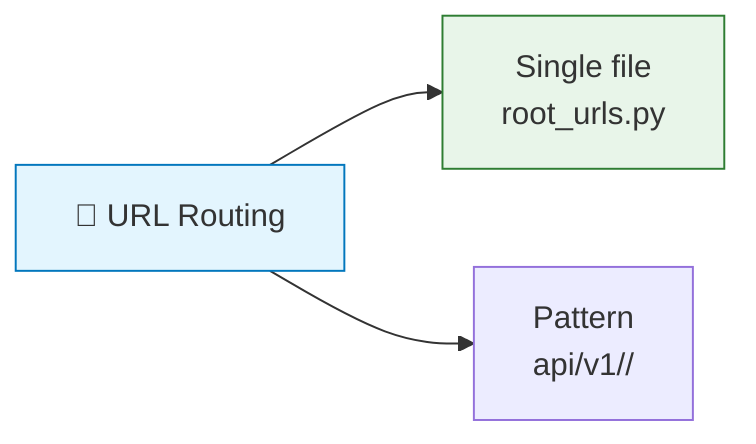

All URLs are in a single file: `src/Presentation/root_urls.py` (set as `ROOT_URLCONF`).

Pattern: `api/v1/<resource>/<action>`

---

## 📋 Adding a New Endpoint

### Step 1: Create the View

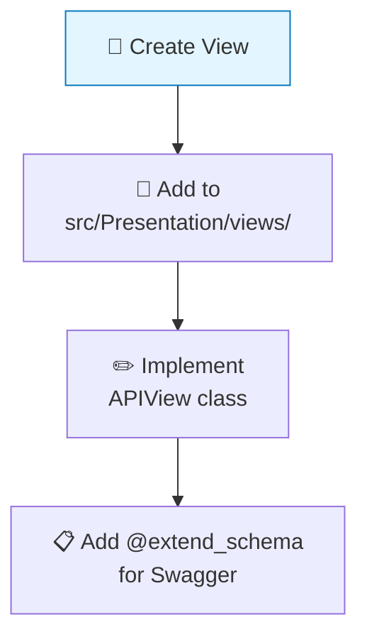

```python
from rest_framework.views import APIView
from rest_framework.response import Response
from drf_spectacular.utils import extend_schema, inline_serializer

class MyNewView(APIView):
    permission_classes = [IsAuthenticated]  # or [IsAdminUser]

    @extend_schema(
        tags=["Tag Name"],
        summary="Short description",
        request=inline_serializer(name="Request", fields={...}),
        responses={200: None},
    )
    def post(self, request):
        return Response({"result": "data"})
```

### Step 2: Register the URL

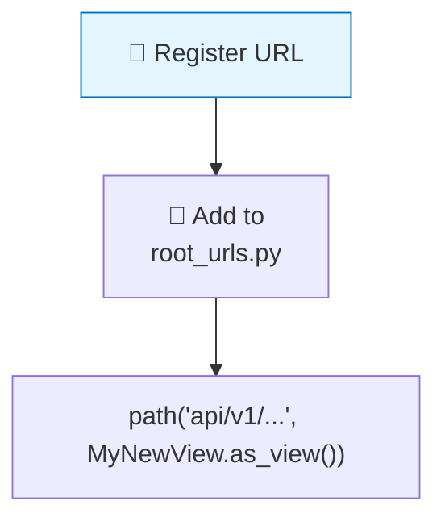

```python
from src.Presentation.views.my_views import MyNewView

urlpatterns = [
    path("api/v1/my-endpoint", MyNewView.as_view(), name="my-endpoint"),
]
```

### Step 3: Add Serializers (if needed)

Add to `src/Presentation/schemas.py` if the request/response needs Swagger documentation.

### Step 4: Add Models (if needed)

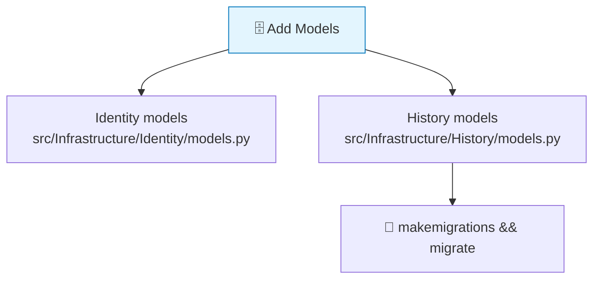

---

## 📡 Adding a New gRPC Method

### Step 1: Update the Proto

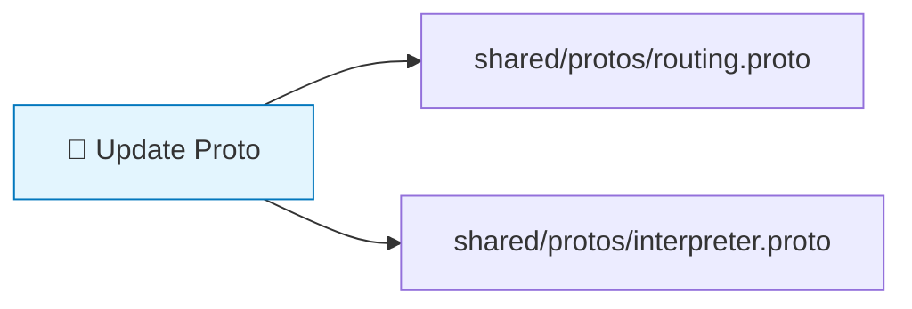

### Step 2: Sync to Service-Local Copies

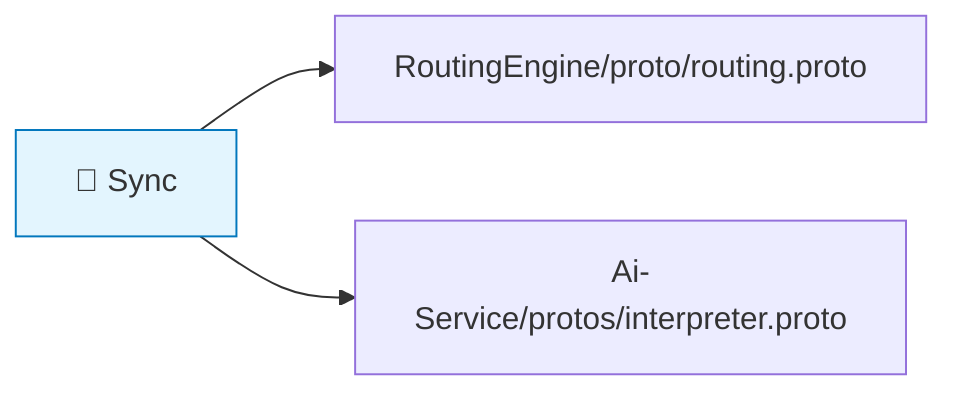

### Step 3: Generate Stubs

| Environment | Generation |
|-------------|------------|
| **Django API** | `entrypoint.sh` auto-generates on container build |
| **C++ RoutingEngine** | CMake generates during build |

### Step 4: Implement

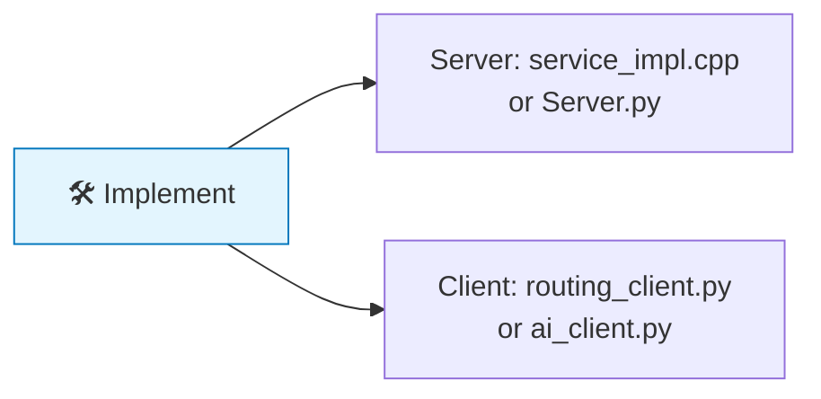

---

## 🧪 Testing

### Unit Tests

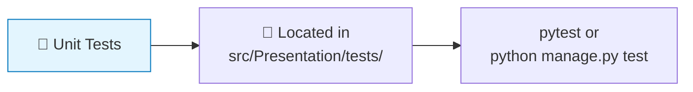

```bash
docker compose exec web python manage.py test
```

### Static Analysis (CI Pipeline)

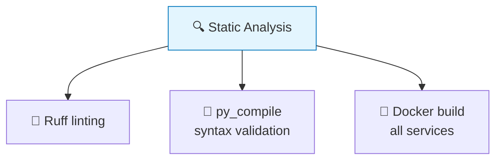

- **Ruff**: `ruff check API/Wslny/src/`
- **py_compile**: Syntax validation on all source files
- **Docker build**: All three services

### Manual Testing (Swagger UI)

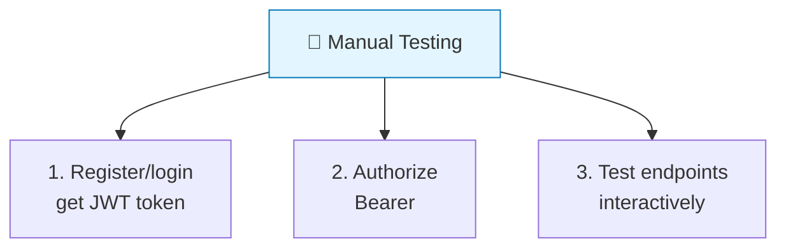

Use Swagger UI at `http://localhost:8000/api/docs/`

---

## 📁 Key Files to Know

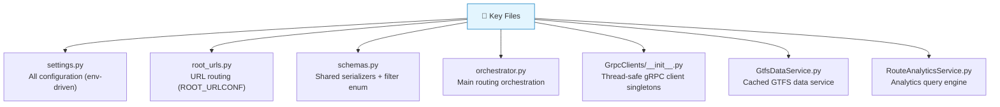

| File | Purpose |
|------|---------|
| `src/Presentation/settings.py` | All configuration (env-driven) |
| `src/Presentation/root_urls.py` | URL routing (ROOT_URLCONF) |
| `src/Presentation/schemas.py` | Shared serializers + filter enum |
| `src/Presentation/views/orchestrator.py` | Main routing orchestration (~1500 lines) |
| `src/Infrastructure/GrpcClients/__init__.py` | Thread-safe gRPC client singletons |
| `src/Core/Application/Transit/GtfsDataService.py` | Cached GTFS data service |
| `src/Core/Application/Admin/Services/RouteAnalyticsService.py` | Analytics query engine |

---

## 🗄️ Database Migrations

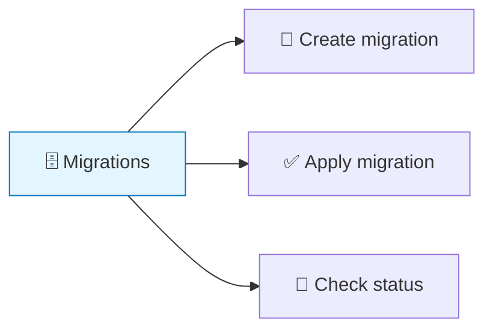

```bash
# Create migration
docker compose exec web python manage.py makemigrations

# Apply migration
docker compose exec web python manage.py migrate

# Check migration status
docker compose exec web python manage.py showmigrations
```

---

## 🔧 Common Development Tasks

### Update GTFS Data

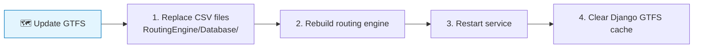

1. Replace CSV files in `RoutingEngine/Database/`
2. Rebuild routing engine: `docker compose build routing-engine`
3. Restart: `docker compose up -d routing-engine`
4. Clear Django GTFS cache: restart the web service

### Change Fare Configuration

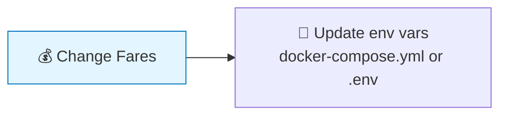

Update environment variables:
- `FARE_BUS_PER_RIDE`
- `FARE_MICROBUS_PER_RIDE`
- `FARE_METRO_UP_TO_9`, etc.

**No code changes needed** — fares are read from settings at runtime.

### Add a New Admin Analytics Endpoint

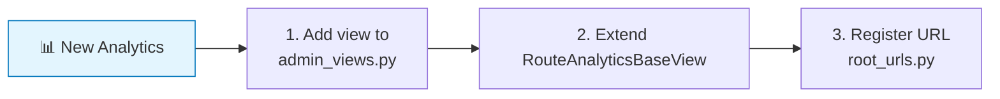

1. Add the view to `src/Presentation/views/admin_views.py` or `admin_management_views.py`
2. Extend `RouteAnalyticsBaseView` for shared filter/pagination utilities
3. Register URL in `root_urls.py`

### Modify the Proto Contract

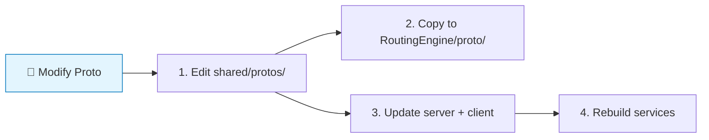

1. Edit `shared/protos/routing.proto`
2. Copy to `RoutingEngine/proto/routing.proto`
3. Update both server (C++ `service_impl.cpp`) and client (Python `routing_client.py`)
4. Rebuild both services