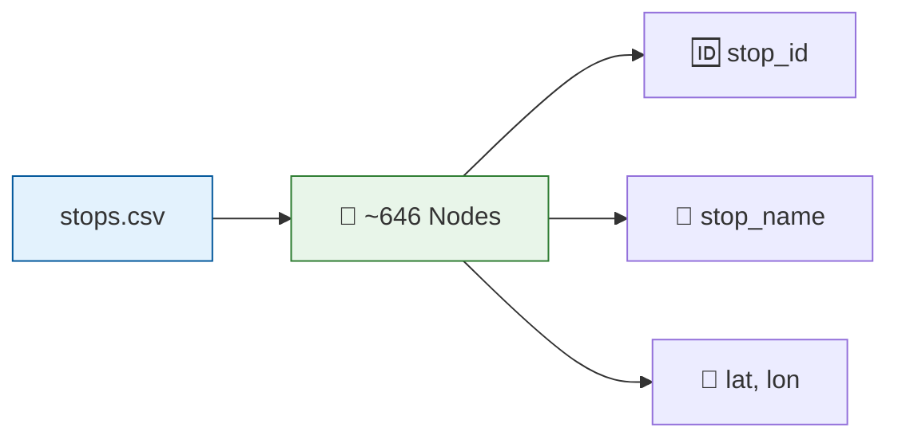
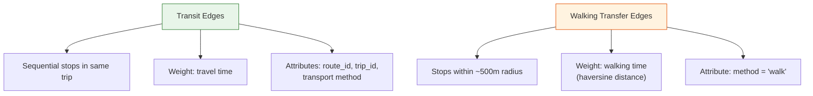
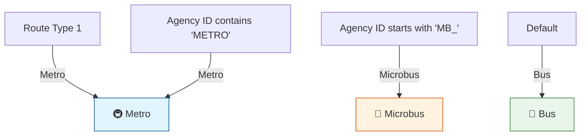
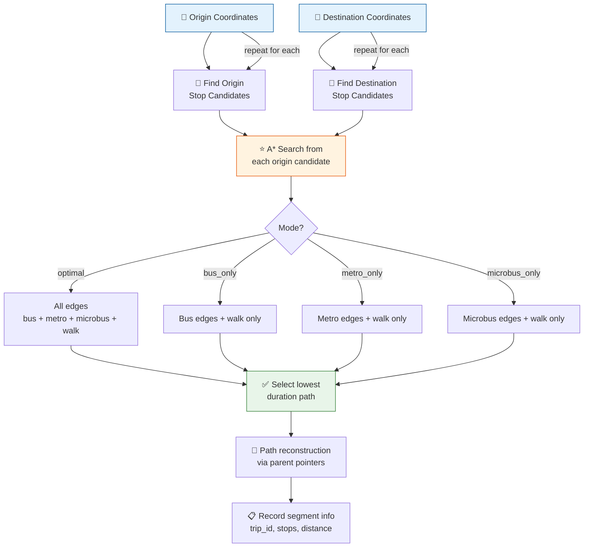
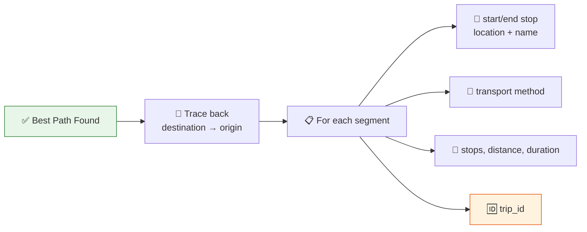
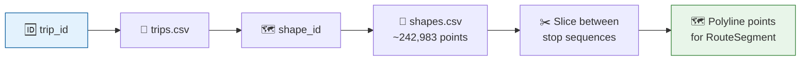
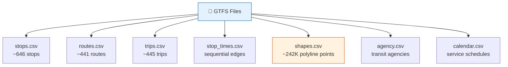
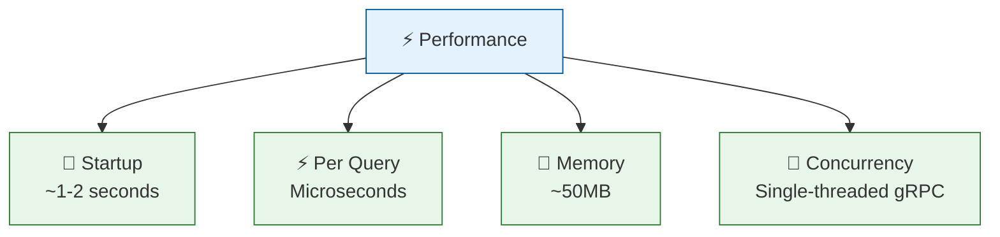
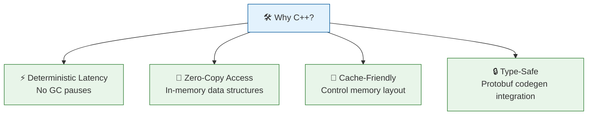

# Routing Engine

## Overview

The **Routing Engine** is a C++ gRPC service that computes public transit routes using the A* algorithm over an in-memory graph built from GTFS data for Greater Cairo.

```mermaid
graph TD
    subgraph Startup["🚀 Startup"]
        A["📁 GTFS CSVs"] --> B["🔧 Parse CSVs"]
        B --> C["📊 Build Graph<br/>nodes = stops<br/>edges = transit + walking"]
        C --> D["🗺️ Load Shape Polylines<br/>~242K points"]
        D --> E["✅ Ready on Port 50051"]
    end

    subgraph Request["📥 Per Request"]
        F["📍 Coordinates"] --> G["🔍 Find Nearby Stops"]
        G --> H["⭐ A* Search<br/>for each mode"]
        H --> I["📋 Build Segments"]
        I --> J["✂️ Attach Polylines<br/>from GTFS shapes"]
        J --> K["📦 RouteResponse"]
    end

    style Startup fill:#e8f5e9,stroke:#2e7d32
    style Request fill:#fff3e0,stroke:#e65100
```



---

## Graph Construction

### Nodes (Stops)



Each transit stop becomes a graph node with: ID, name, latitude, longitude.

### Edges



| Edge Type | Source | Weight | Attributes |
|-----------|--------|--------|------------|
| **Transit** | `stop_times.csv` + `trips.csv` | Travel time | route_id, trip_id, transport method |
| **Walking** | Generated at startup | Walking time | method = "walk" |

### Transport Mode Classification



| Source | Mode |
|--------|------|
| Route type 1 | Metro |
| Agency ID contains "METRO" | Metro |
| Agency ID starts with "MB_" | Microbus |
| Default | Bus |

---

## A* Algorithm

### Heuristic

**Haversine distance** divided by a maximum speed constant. This is:
- **Admissible**: Never overestimates actual travel time
- **Consistent**: Satisfies triangle inequality for optimal path finding

### Search Process



### Path Reconstruction



---

## Polyline System

### Shape Loading

At startup, `graph.cpp::loadShapes()` reads all shape points:

```cpp
std::unordered_map<shape_id, vector<ShapePoint>> shapes;
```

Points are sorted by sequence number for accurate slicing.

### Trip-Shape Mapping



Each trip has a `shape_id` (from `trips.csv`). During pathfinding, segments store their `trip_id`.

### Polyline Slicing

In `service_impl.cpp::populatePolyline()`:

1. Get segment's `trip_id` → find its `shape_id`
2. Load shape points from `shapes.csv`
3. Find sequence numbers for segment's start and end stops
4. Slice shape points between those sequences
5. Attach resulting `{lat, lon}` array to `RouteSegment`

---

## GTFS Data Files



| File | Records | Used For |
|------|---------|----------|
| `stops.csv` | ~646 | Graph nodes (stop locations) |
| `routes.csv` | ~441 | Route metadata + transport mode |
| `trips.csv` | ~445 | Trip → route + shape mapping |
| `stop_times.csv` | — | Sequential stop edges |
| `shapes.csv` | ~242,983 | Polyline points for map drawing |
| `agency.csv` | — | Agency → transport mode mapping |
| `calendar.csv` | — | Service schedules |

---

## Project Structure

```
RoutingEngine/
├── CMakeLists.txt          # CMake build (protobuf + grpc codegen)
├── Dockerfile              # Multi-stage build
├── proto/routing.proto     # Service definition (local proto copy)
├── include/
│   ├── types.hpp           # Data structures (Stop, Edge, ShapePoint)
│   ├── graph.hpp           # Graph class: loading, node/edge storage
│   └── pathfinder.hpp      # A* algorithm
├── src/
│   ├── graph.cpp           # GTFS parsing, graph building, shape loading
│   ├── pathfinder.cpp      # A* implementation with trip_id tracking
│   └── service_impl.cpp    # gRPC service + polyline population
├── Database/               # GTFS CSV data (Cairo transit)
│   ├── stops.csv           # ~646 stops
│   ├── routes.csv          # ~441 routes
│   ├── trips.csv           # ~445 trips
│   ├── stop_times.csv      # Sequential edges
│   ├── shapes.csv          # ~242K polyline points
│   ├── agency.csv          # Transit agencies
│   └── calendar.csv        # Service schedules
└── tools/
    └── validate_gtfs.py   # Data quality checker
```

---

## Data Quality Tool

```mermaid
graph LR
    A["python validate_gtfs.py"] --> B["📁 Check Database"]
    B --> C["❌ Orphan stops"]
    B --> D["🔗 Referential integrity"]
    B --> E["🔄 Duplicate records"]
    B --> F["⚠️ Suspicious clusters"]

    style A fill:#e3f2fd,stroke:#01579b
    style C & D & E & F fill:#ffebee,stroke:#c62828
```

```bash
python tools/validate_gtfs.py --db-path Database
```

**Checks:**
- Orphan stops (in `stops.csv` but not in `stop_times.csv`)
- Referential integrity (stop_ids, route_ids, trip_ids)
- Duplicate stop records
- Suspicious same-name clusters with large geographic spread

---

## Configuration

| Variable | Default | Description |
|----------|---------|-------------|
| `GTFS_PATH` | `/app/Database` | Path to GTFS CSV files |

---

## Performance Characteristics



| Metric | Value |
|--------|-------|
| **Startup** | ~1-2 seconds for Cairo dataset |
| **Per query** | Microseconds (small graph, ~646 nodes) |
| **Memory** | ~50MB (graph + shapes + indexes) |
| **Concurrency** | Single-threaded gRPC (sufficient for load) |

---

## Why C++



| Reason | Explanation |
|--------|-------------|
| **Deterministic latency** | CPU-intensive graph search without garbage collection pauses |
| **Zero-copy access** | In-memory data structures with direct pointer access |
| **Cache-friendly** | Control over memory layout for hot path optimization |
| **Type-safe** | Easy integration with protobuf C++ codegen |