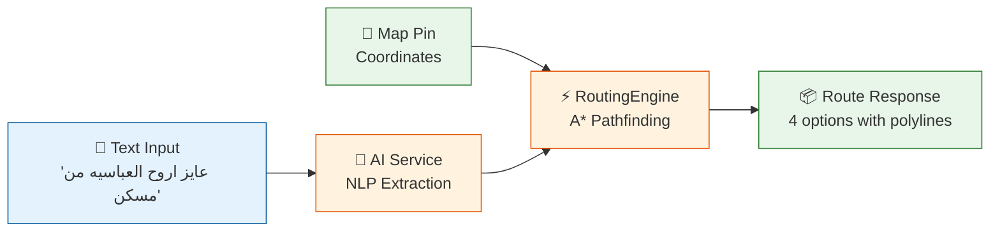
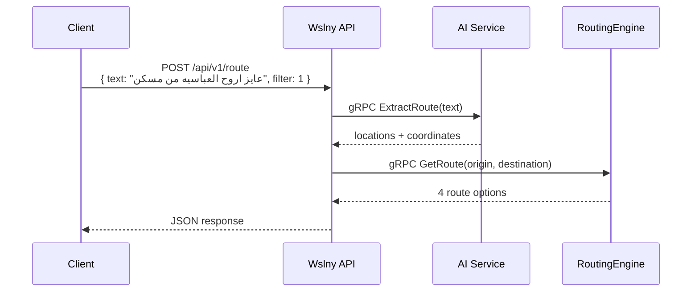
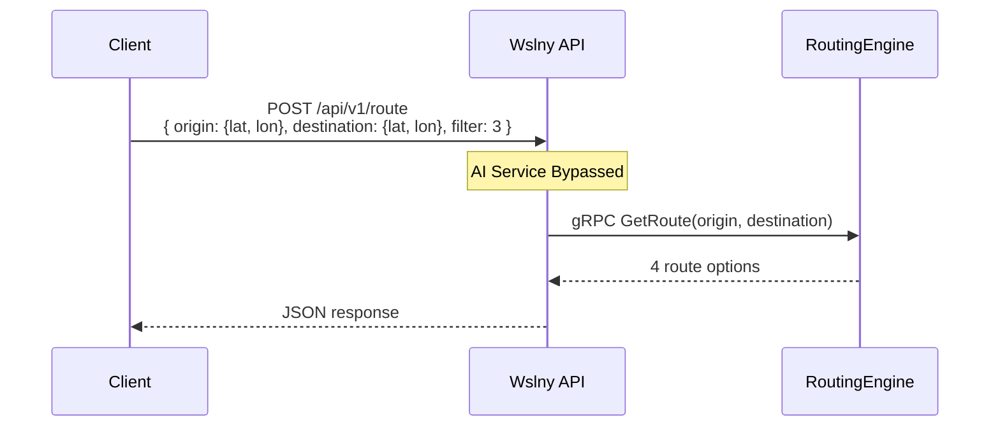
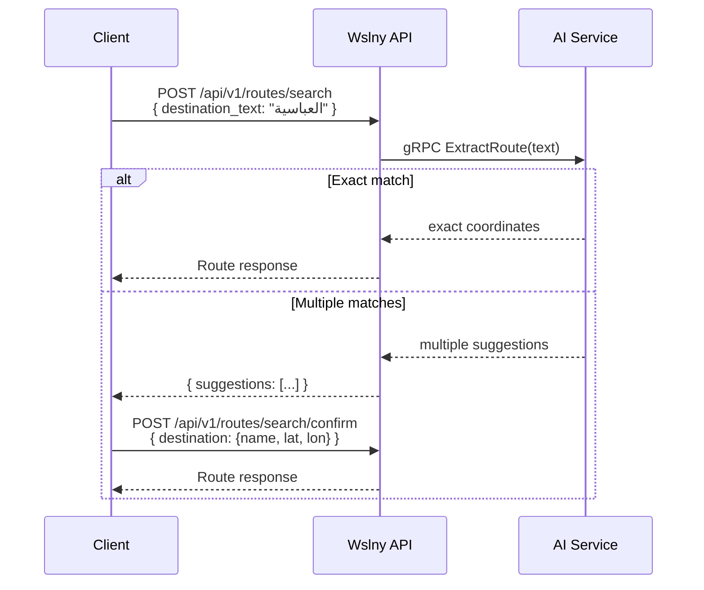
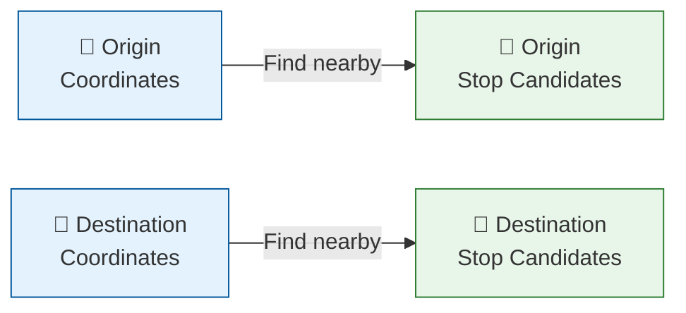
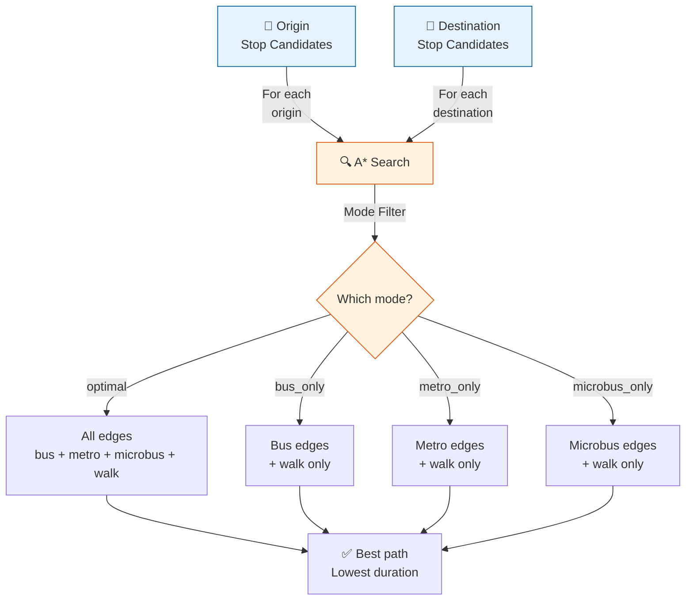
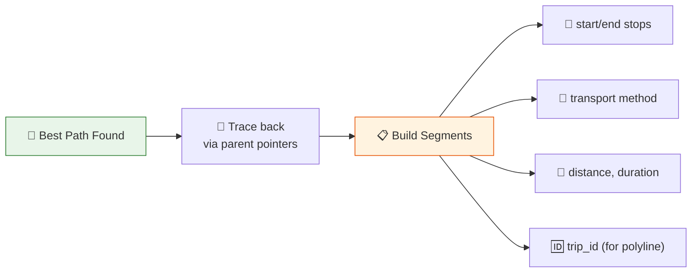
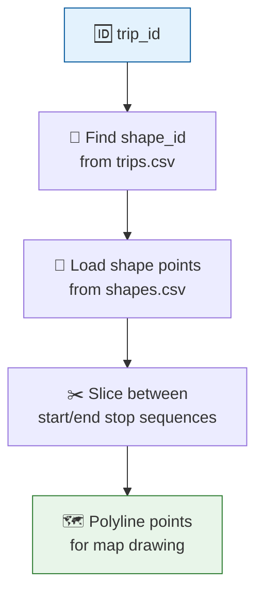
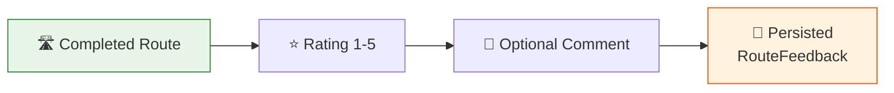
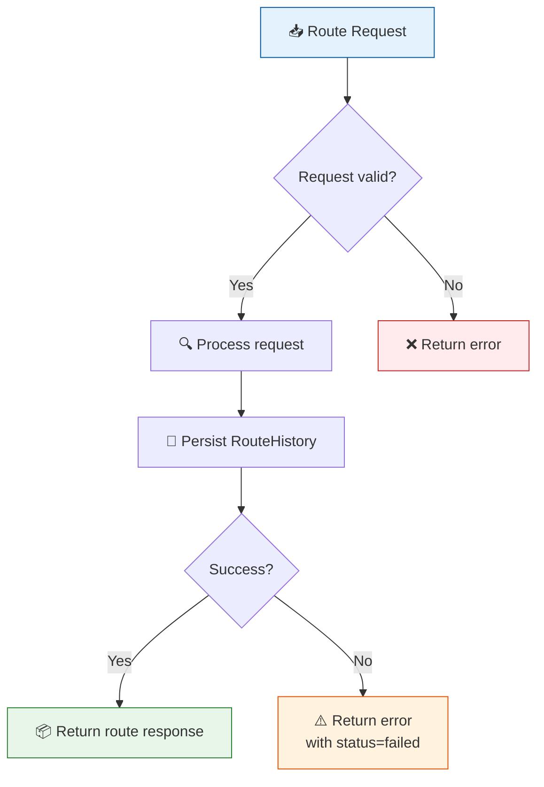

# Routing System

## Overview

The routing system is the **core feature** of Wslny. It computes public transit routes across Greater Cairo's bus, microbus, and metro networks using the A* algorithm running in a C++ gRPC service.



---

## Route Filter Types

| Enum | Name | Description |
|------|------|-------------|
| 1 | `optimal` | Best overall route across all transport modes |
| 2 | `fastest` | Shortest total duration |
| 3 | `cheapest` | Lowest estimated fare |
| 4 | `bus_only` | Uses only bus + walking |
| 5 | `microbus_only` | Uses only microbus + walking |
| 6 | `metro_only` | Uses only metro + walking |

---

## Request Modes

### Text Mode (Natural Language)



**Request:**
```json
{
  "text": "عايز اروح العباسيه من مسكن",
  "filter": 1,
  "current_location": { "lat": 30.12, "lon": 31.34 }
}
```

> `current_location` is optional — used as fallback when AI can't extract origin.

### Map Pin Mode (Coordinates Only)



**Request:**
```json
{
  "origin": { "lat": 30.05, "lon": 31.24 },
  "destination": { "lat": 30.07, "lon": 31.28 },
  "filter": 3
}
```

### Search + Confirm Mode (Ambiguous Destinations)



---

## How Routing Works

### 1. Coordinate Input

The routing engine receives origin and destination coordinates from the Wslny API.

### 2. Stop Candidate Search



The engine finds all transit stops within walking distance (~500m) of both origin and destination coordinates.

### 3. A* Graph Search



**Heuristic**: Haversine distance divided by maximum speed (admissible — never overestimates).

### 4. Path Reconstruction



### 5. Polyline Attachment



GTFS shapes provide the actual geographic path of each transit line:
1. Segment's `trip_id` → maps to `shape_id` in trips data
2. Shape's ordered `{lat, lon}` points loaded from `shapes.csv` (~242,983 points)
3. Shape sliced between segment's start and end stop sequences
4. Resulting polyline attached to `RouteSegment` in gRPC response

### 6. Fare Estimation

After receiving the route from the engine, the Django API estimates fares:

| Transport | Calculation |
|-----------|-------------|
| **Metro** | Tiered by total metro stops: ≤9=8 EGP, ≤16=10, ≤23=15, ≤39=20, 40+=20 |
| **Bus** | 20 EGP per bus ride segment |
| **Microbus** | 10 EGP per microbus ride segment |

> Fare values are configurable via environment variables.

---

## Route Response Structure

```json
{
  "request_id": "uuid",
  "source": "text | map",
  "filter": 1,
  "from_name": "origin name",
  "to_name": "destination name",
  "query": {
    "origin": { "lat": 30.05, "lon": 31.34 },
    "destination": { "lat": 30.07, "lon": 31.28 }
  },
  "route": {
    "type": "optimal",
    "found": true,
    "totalDurationSeconds": 1800,
    "totalDurationFormatted": "30 min",
    "totalSegments": 3,
    "totalDistanceMeters": 8500.0,
    "estimatedFare": 30.0,
    "walkDistanceMeters": 450.0,
    "segments": [
      {
        "startLocation": { "lat": 30.05, "lon": 31.34, "name": "مسكن" },
        "endLocation": { "lat": 30.055, "lon": 31.30, "name": "محطة مترو مسكن" },
        "method": "walk",
        "numStops": 0,
        "distanceMeters": 450,
        "durationSeconds": 300,
        "polyline": [
          { "lat": 30.05, "lon": 31.34 },
          { "lat": 30.052, "lon": 31.33 },
          { "lat": 30.055, "lon": 31.30 }
        ]
      },
      {
        "startLocation": { "lat": 30.055, "lon": 31.30, "name": "محطة مترو مسكن" },
        "endLocation": { "lat": 30.072, "lon": 31.28, "name": "محطة مترو العباسية" },
        "method": "metro",
        "numStops": 8,
        "distanceMeters": 7200,
        "durationSeconds": 1200,
        "polyline": [ ... ]
      }
    ]
  }
}
```

---

## Route Alternatives

`POST /api/v1/routes/alternatives` returns **all found** route types (not just the selected one), sorted by duration:

```json
{
  "alternatives": [
    { "type": "metro_only", "totalDurationSeconds": 1500, "totalDistanceMeters": 7200, ... },
    { "type": "bus_only", "totalDurationSeconds": 2400, "totalDistanceMeters": 8500, ... },
    { "type": "optimal", "totalDurationSeconds": 1800, "totalDistanceMeters": 7800, ... }
  ],
  "count": 3
}
```

---

## Route Feedback

After completing a route, users can submit feedback:



```json
POST /api/v1/routes/feedback
{
  "request_id": "uuid-from-route-response",
  "rating": 4,
  "comment": "Mostly accurate but transfer was confusing"
}
```

**Rules:**
- Rating: 1 (poor) to 5 (excellent)
- One feedback per user per request_id (resubmission updates existing)
- Queryable by admins via analytics endpoints

---

## Route History



Every route request is persisted to `RouteHistory`:
- **Input**: text, coordinates, filter
- **Result**: route type, duration, distance, fare
- **Latency**: AI time, routing time, total time
- **Status**: success/failed + error information

This powers the admin analytics dashboard.